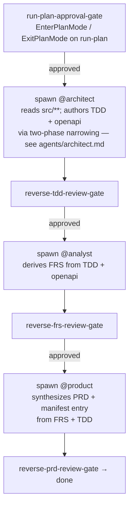

# /orchestra

Routes a `/orchestra` invocation to one of nine strategies. Strategy = first whitespace token (`$1`) × `docs/` state × `src/**` state. Greenfield → forward chain; brownfield → reverse-then-forward; empty → usage block.

This command body runs in the main thread between agent spawns. It owns every gate (`AskUserQuestion`, `EnterPlanMode`, `ExitPlanMode`); spawned agents do not.

## Usage

```
/orchestra                                              Print this block.
/orchestra spec-to-code [<intent>]                      Forward chain. PRD → FRS → SAD → ADR? → TDD → openapi → code+tests → TSR. Tail seeds slug + PRD title.
/orchestra code-to-spec                                 Reverse chain. Scope derives from workspace_kind + scope_level.
/orchestra code-to-spec system                          Force scope_level: system-wide (multi-repo).
/orchestra code-to-spec service:<name> --source=<path>  Force scope_level: per-service. --source REQUIRED.
/orchestra <intent>                                     Smart router. ≥3 AskUserQuestion clarifications before any spawn; Q1 seeds from intent text — never re-asks.
```

**Flags:**

- `--autonomy={EXECUTION_ONLY,JOINT_PROCESSING,OPTION_SYNTHESIS,DRAFT_AND_GATE,FULL_AUTONOMY}` — highest-precedence autonomy resolution. Overrides `autonomy.level`.
- `--spawn-mode={subagent,teams}` — overrides `spawn_mode`.
- `--source=<path>` — read-root for source inspection. REQUIRED with `scope_level: per-service`. Absolute or `cwd`-relative; leading `@` stripped. Persists to `local.yaml.source_path`.

## Invariants

**Main thread owns gates.** Spawned agents MUST NOT call `AskUserQuestion`, `EnterPlanMode`, or `ExitPlanMode` — subagent permission frame is frozen at spawn. Every gate is a main-thread pause between agent spawns.

**Hooks own side effects.** 7 runtime hooks (see Runtime hooks table) own their events. Do not write to `<cwd>/.orchestra/metrics/events.jsonl`, hash artifact frontmatter, or replicate any hook's work. Provenance and review state live in artifact frontmatter (`status`, `verdict`, `readers`, `sections`); drift detection is `git diff` in CI.

**`agent-plan-sync` owns PLAN mutation.** `tasks:`, `tasks_pending`, `tasks_in_progress`, `tasks_done`, `updated:`, top-level `status:`, and the `## Tasks` checklist body of every per-agent PLAN file under `<cwd>/.orchestra/tasks/<run-id>/<agent>/<feature-id>.md` are hook-owned. Agents author `## Approach` only.

## Parse `$1` / `$ARGUMENTS`

`$1` (first whitespace-token) is the subcommand selector. `$ARGUMENTS` is the full tail (used as Q1 restate-intent seed when `$1` is not a known subcommand).

| `$1` | Strategy | `$ARGUMENTS` use |
|---|---|---|
| empty | S1 | — (emit usage block, end turn) |
| `spec-to-code` | S2/S3/S4 | tail = feature-slug seed + PRD title seed |
| `code-to-spec` | S5 | scope from `system.yaml.workspace_kind` |
| `code-to-spec system` | S6 | force `scope_level: system-wide` |
| `code-to-spec service:<name> --source=<path>` | S7 | `--source=<path>` REQUIRED |
| anything else | S8/S9 | full `$ARGUMENTS` = Q1 restate-intent seed (never re-asked) |

`--source=<path>` accepts absolute or `cwd`-relative paths; leading `@` (Claude Code path-mention shorthand) is stripped by preflight.

## Strategy dispatch (S1–S9)

Per-strategy walk-throughs (preconditions, concrete trace, expected artifacts, edge cases) live under `skills/orchestra-strategies/references/S<N>-*.md`. Invoke via `Skill: orchestra-strategies` after classifying `$1`.

| Strategy | Entry | Preconditions | Action | Walk-through |
|---|---|---|---|---|
| **S1** | `/orchestra` | — | Emit Usage block. No chain. | `S1-empty.md` |
| **S2** | `/orchestra spec-to-code` | `docs/` empty, `src/**` empty | Full forward chain: `@product` → `@analyst` → `@architect` → `@lead` → fan-out → TSR. | `S2-greenfield-clean.md` |
| **S3** | `/orchestra spec-to-code` | Locked `docs/<feature-id>/` + partial impl OR partial-locked layers | Trust locked frontmatter as-is. Resume at first unlocked layer OR first missing implementer artifact. | `S3-greenfield-partial.md` |
| **S4** | `/orchestra spec-to-code` | Locked N features + `src/**` empty | Enumerate every locked `<feature-id>/` in current service's `features.yaml`. Spawn N intra-service fan-outs in one message. One TSR per feature. | `S4-greenfield-multifeature.md` |
| **S5** | `/orchestra code-to-spec` | `src/**` exists, no second token | Single-repo → `per-service`; multi-repo → `system-wide`. | `S5-brownfield-auto-scope.md` |
| **S6** | `/orchestra code-to-spec system` | Multi-repo | Force `scope_level: system-wide`. Authors `SAD.md` + ADRs + `business-invariants.md` + per-service BR-AC. | `S6-brownfield-system-wide.md` |
| **S7** | `/orchestra code-to-spec service:<name> --source=<path>` | `--source=<path>` REQUIRED | Force `scope_level: per-service`. Skip architecture layer. Persist `source_path` to `local.yaml`. | `S7-brownfield-per-service.md` |
| **S8** | `/orchestra <intent>` | `src/**` empty (greenfield) | 3× `AskUserQuestion` (Q1 restate-intent / Q2 scope / Q3 constraints). Q1 SEEDS from `$ARGUMENTS`. Route to S2/S3/S4 per `docs/` state. | `S8-router-greenfield.md` |
| **S9** | `/orchestra <intent>` | `src/**` present (brownfield) | 1× `AskUserQuestion` permission gate. `no` → abort. `yes` → S5/S6/S7. After reverse locks: 3× `AskUserQuestion` post-reverse. Route to S2/S3/S4. | `S9-router-brownfield.md` |

## Preflight contract

`hooks/scripts/orchestra-preflight.js` runs on `UserPromptSubmit` (matcher `^/orchestra(?::orchestra)?(\s|$)`) and emits an `<orchestra-preflight>` YAML block to additional context. Block fields:

- `mode` — `greenfield` | `brownfield`
- `workspace_kind` — `single-repo` | `multi-repo` | `null`
- `service_name` — `<string>` | `null`
- `scope_level` — `system-wide` | `per-service` | `null`
- `cached_fields` — `autonomy.level`, `spawn_mode`, `primary_language`, `framework`, `source_path`, `primary_database`, `migration_tool` (each `<value>` or `null`; greenfield / brownfield predicates per Bootstrap table)
- `missing_fields` — `[<field>, ...]`
- `docs_provenance` — `orchestra-generated` | `unknown`

**First action every `/orchestra` run.** Read the block. Absent → halt with `[orchestra] preflight hook did not emit — check hooks/hooks.json registration`. Surface `AskUserQuestion` only for `missing_fields`. Never re-prompt resolved fields.

## Bootstrap

Walk `missing_fields` in declaration order. Before each prompt, re-evaluate per-field predicate against in-session answers — skip when false (e.g., `migration_tool: none` answered → `primary_database` predicate fails, prompt skipped).

| Field | Shape | Default / predicate |
|---|---|---|
| `autonomy.level` | 5-option `AskUserQuestion`: `EXECUTION_ONLY` \| `JOINT_PROCESSING` \| `OPTION_SYNTHESIS` \| `DRAFT_AND_GATE` \| `FULL_AUTONOMY` | Default `DRAFT_AND_GATE`. CLI: `--autonomy=<tag>`. |
| `spawn_mode` | `subagent` \| `teams` | Default `subagent`. CLI: `--spawn-mode=<value>`. |
| `workspace_kind` | `single-repo` \| `multi-repo` | Only when null. Persist to `.orchestra/system.yaml`. |
| `service_name` | walk repo-root for build manifests; surface candidates | Only when null AND `multi-repo`. Reject names containing `/`, `\`, whitespace, `..`, or `system` \| `metrics` \| `inventory`. |
| `scope_level` | `system-wide` \| `per-service` | Only when null AND `multi-repo`. Single-repo auto-set to `per-service`. |
| `primary_language`, `framework` | free-text + Other | Only when `mode: greenfield` AND null. |
| `source_path` | conventional `./services/<service_name>/` default + Other | Only when `mode: brownfield` AND `scope_level: per-service` AND null. Reject empty; require directory exists. |
| `migration_tool` | `flyway` \| `liquibase` \| `none` | Only when `mode: greenfield` AND null. Default `flyway` when `primary_language` ∈ `{java, kotlin}`; `none` otherwise. `ddl-auto` is invalid. CLI: `--migration-tool=<value>`. |
| `primary_database` | `postgresql` \| `mysql` \| `mariadb` \| `sqlite` \| `mssql` \| Other | Only when `mode: greenfield` AND `migration_tool != none` AND null. Drives SQL dialect. |

Persist via `mcp__orchestra-utils__upsert_local_yaml`. Workspace identity via `mcp__orchestra-utils__write_system_yaml`. After both succeed, call `mcp__orchestra-utils__claude_md(context_path)` — splices orchestra section into consumer's `CLAUDE.md`.

## Run-plan + approval gate

After bootstrap locks: spawn `@lead` with `task: run-plan-author` AND `chain: reverse-pass | forward-chain` (`code-to-spec` → `reverse-pass`; `spec-to-code` → `forward-chain`; `<intent>` brownfield → `reverse-pass` then `forward-chain` post-pause).

`@lead` writes `<context_path>/.orchestra/<service_name>/run-plan.md` per `schemas/run-plan.schema.md` with frontmatter `status: draft, run_plan_status: drafted` and ends turn.

On `@lead` return:

1. `Read(<context_path>/.orchestra/<service_name>/run-plan.md)`.
2. Approval splits by `chain:`:
   - **`reverse-pass`** — `EnterPlanMode` with run-plan body as plan content (`S-FEATURES-001` is the load-bearing section reviewer scans). Plan-mode body MUST prepend an `## Auto-mode notice` warning that accept flips `auto_mode: true` and skips between-phase gates / per-feature confirmations / `DRAFT_AND_GATE` checkpoints; reject keeps them firing. `ExitPlanMode` collects accept/reject.
   - **`forward-chain`** — `AskUserQuestion(approve | revise)`.
3. Accept → `mcp__orchestra-utils__upsert_local_yaml(auto_mode: true, run_plan_status: approved)`; flip run-plan frontmatter `run_plan_status: approved` + `status: locked` via `Write` (`.orchestra/**` outside `locked-status-reject` scope).
4. Reject/revise splits by `chain:`:
   - **`reverse-pass`** — main thread updates plan-mode file inline (native edit affordance, single `ExitPlanMode` on accept). Re-spawn `@lead` only when revision requires fresh upstream artifact content. Max 3 cycles; cycle 4 → `pipeline/run-plan-ESCALATE.md`.
   - **`forward-chain`** — flip frontmatter `run_plan_status: revision_requested`; capture notes; re-spawn `@lead` with notes lifted into `## Revision notes` under `S-APPROVAL-001` and `revision_cycle` incremented. Max 3 cycles; cycle 4 → `pipeline/run-plan-ESCALATE.md`.

**Mid-run external-state change.** "DB ready, restart" or any external-state shift AFTER a TDD has locked → before resuming, re-spawn `@lead` for focused schema-diff pass against `S-DATA-001`. Restart-first is a process violation logged in the reverse-pass run report.

After `auto_mode: true`: between-phase gates, per-feature confirmations, and `DRAFT_AND_GATE` checkpoints skip. Structural-failure halts + `ESCALATE` / `DEADLOCK` emission always preserved.

## Per-feature execution model

For each `<feature-id>` enumerated in run-plan `S-FEATURES-001`, drive a 5-gate state machine (business path) or single-gate (tech path).

### Intent classification (S8/S9 path only)

Tech-vs-business classifier runs BEFORE feature-id mint. Inline prompt:

```
Classify the user intent into one of two paths:

- business: new user-visible feature, new endpoint, UI change, business rule change, data model change. Anything changing what users can do or see.
- tech: dependency bump, lint fix, internal refactor with zero contract change, observability tweak, build tooling, log format change. Zero observable surface delta.

DEFAULT: business. Ambiguous phrasing → business.

Confidence:
- HIGH — proceed silently to chosen path.
- LOW or MEDIUM — emit AskUserQuestion with two options labelled "Business path" and "Tech path".
```

`spec-to-code` and `code-to-spec` entry shapes skip classifier — business path implied.

### Feature-id mint (manifest-aware)

Mint `<feature-id>` BEFORE first agent spawn:

1. Read `.orchestra/<service_name>/features.yaml` (init `{ features: [] }` when absent).
2. `<short-service-name>` = `local.yaml.service_name`.
3. `<NNN>` = max numeric segment across all `features[].id` + 1, zero-padded.
4. User supplies slug at gate 1 (or implicit from intent at HIGH classifier confidence).
5. Concatenate `<short-service-name>-<NNN>-<slug>` (e.g., `order-001-checkout`).

Slug shape: tech / CRUD / lifecycle noun. Reject Journey-gate category labels (`forward-purchase`, `abandonment`, `reversal`) and verb-prefixed slugs (`regen-*`, `refactor-*`, `fix-*`).

### Gate state machine

**Business path:**

```mermaid
graph TD
  C[tech-business-classifier-gate<br/>LOW/MEDIUM conf. only] -->|approved or HIGH default| P[spawn @product → PRD locked + features.yaml entry]
  P --> G1[prd-review-gate]
  G1 -->|approved| A[spawn @analyst → FRS locked]
  A --> G2[frs-review-gate]
  G2 -->|approved| AR[spawn @architect → TDD + openapi/asyncapi locked]
  AR --> G3[tdd-impl-readiness-gate]
  G3 -->|approved| L[spawn @lead → run-plan locked]
  L --> G4[run-plan-approval-gate]
  G4 -->|approved| F[parallel fan-out:<br/>@backend ‖ @frontend ‖ @test-author]
  F --> T[@test-runner → @evaluator + @reviewer<br/>→ TSR locked]
```

**Tech path** skips PRD / FRS / TDD: classifier returns `tech` (HIGH silent OR LOW/MEDIUM approved) → spawn `@lead` (tech mode) → done.

Per-gate response: **Approve** → spawn downstream. **Re-author** → flip upstream frontmatter `locked` → `draft`, re-spawn with `Feedback:` block. **Halt** → stop chain, return summary; chain state recovers from filesystem on re-invocation.

### Chain state recovery

No state carries between user turns. On re-invocation, current position derives from filesystem per active `<feature-id>` (entry in `features.yaml` lacking a TSR verdict):

| Filesystem state | Next action |
|---|---|
| `<feature-id>-PRD.md` absent | spawn `@product` |
| PRD locked, no FRS | spawn `@analyst` |
| FRS locked, no TDD | spawn `@architect` |
| TDD + openapi locked, no run-plan | spawn `@lead` |
| run-plan present + `status: draft` | run-plan-approval-gate |
| run-plan locked, fan-out incomplete | spawn fan-out |
| fan-out complete, no TSR verdict | `@test-runner` → `@evaluator` + `@reviewer` |

`features.yaml` carries the dependency DAG; per-feature `pipeline/<feature-id>/` directory carries chain-state artifacts. No separate state file.

### Brownfield reverse gates

Reverse-pass reverses the chain: `src` → `@architect` → `@analyst` → `@product`. Each handoff is gated:



Reverse-pass writes the `features.yaml` entry at the END (when `@product` synthesizes), not the start.

**Per-artifact `reverse_authoring_mode`.** Every reverse-pass author runs **classify → author → lock** against each target artifact path. Provenance + on-disk status drive a three-value frontmatter enum:

- **`cite-as-is`** — artifact at this path is `present-locked` AND already in plugin format (frontmatter shape matches `schemas/pipeline-artifact.schema.md`). Lift unchanged as input to subsequent chain authors; no re-write.
- **`copy-and-modify`** — artifact present but format-drift in frontmatter / anchors. Adapt frontmatter + anchors; preserve body content.
- **`re-author`** — artifact absent OR `present-draft` with structural divergence. Full rewrite.

`docs/README.md` `generated_by: orchestra` provenance marker (read by `orchestra-preflight`) decides eligibility — absent marker pins every reverse-pass author to `re-author`. `spec-to-code`-authored artifacts omit the field; the forward chain has no prior state to classify against.

## Algorithm payloads

**`spec-to-code` (S2/S3/S4) per-feature chain** — see `agents/product.md`, `agents/analyst.md`, `agents/architect.md`, `agents/lead.md` for per-layer authoring contracts.

After `run-plan-approval-gate`, `@lead` spawns parallel fan-out (`@backend` ‖ `@frontend` ‖ `@test-author`) gated on TDD + openapi `status: locked`. Converge on `@test-runner` → `@evaluator` + `@reviewer` → `<feature-id>-TSR.md` sections locked.

**Inter-feature parallel spawn (S4).** `S-FEATURES-001` with ≥2 features and no dependency edge in `features.yaml` → main thread spawns per-feature chains in ONE message.

**`code-to-spec` (S5/S6/S7) reverse-pass** — see `agents/architect.md` `### Reverse-pass discipline` for two-phase narrowing (phase A service-shell author + phase B per-feature DAG-rank-batched fan-out), auto-promote brief, arrow-evidence rule, per-handler error contract, persistence-shape priority, spec-correctness audit (Java/Spring sites → `skills/java-development`).

Authorized agent set during `task: reverse-pass`: `{@product, @architect, @lead}` only. Forbidden: `{@backend, @frontend, @test-author, @test-runner, @evaluator, @reviewer}`. Reverse-pass emitting `src/main/**`, `src/test/**`, or TSR = structural defect.

Authored set by scope:

| Scope | Artifacts |
|---|---|
| `single-repo` (auto `per-service`) | per-feature `{PRD, FRS, TDD, openapi.yaml}` + `<service_name>-BR-AC.md`. No SAD/ADR/`business-invariants.md`. |
| `multi-repo` + `system-wide` | workspace `SAD.md` + `docs/adr/ADR-*.md` + `docs/business-invariants.md` + per-service BR-AC + per-feature artifacts. |
| `multi-repo` + `per-service` | if workspace `SAD.md` absent → auto-promote: run `system-wide` first, then narrow. Else per-feature artifacts for named service only. |

**`<intent>` router (S8/S9)** — branches per preflight `mode:`:

- `greenfield` → S8: 3× `AskUserQuestion` upfront. **Q1 SEEDS from `$ARGUMENTS`** (user's typed intent is the restate-intent seed; Q1 confirms instead of re-asking). Route to S2/S3/S4 per `docs/` state.
- `brownfield` → S9: 1× workspace-kind-adaptive permission gate. `no` → abort with error. `yes` → S5/S6/S7. After reverse locks: 3× post-reverse `AskUserQuestion`. Route to S2/S3/S4.

Router's questions cap downstream confidence-tier dialogue: downstream agents observe `intent_floor: cleared` and skip their own intent-restate.

## Ratify-spec on locked artifacts

Verification-phase divergences resolve two ways:

- **`ratify-spec`** — artifact's invariant was correct but locked; main thread unlocks via `mcp__orchestra-utils__amend_locked_artifact(context_path, target_path, revision_notes)` (flips `status: locked → revision_requested`, appends `- <ISO-8601> | unlocked by dispatcher | <revision_notes>` to `## Changelog`). Re-spawn original authoring agent with `task: ratify-spec-amend` and revision notes lifted into brief. Agent re-authors the now-unlocked artifact, appends `- <ISO-8601> | ratify-spec-amend by @<agent> | <amendment summary>` row as part of `Write`. Main thread re-locks via `mcp__orchestra-utils__relock_artifact(context_path, target_path, amendment_summary)` (verifies last row is `ratify-spec-amend`, flips `revision_requested → locked`, appends `- <ISO-8601> | re-locked by dispatcher | <amendment_summary>` row).
- **`fix-source`** — source diverged from a still-correct spec; main thread writes corrections to `src/**`; artifact stays untouched (no `## Changelog` row appended).

Net audit trail per ratify-spec cycle: three new rows (`unlocked`, `ratify-spec-amend`, `re-locked`). `pre-write-check.js` `changelog-append-only` rejects any `Write` that mutates / removes / reorders existing rows.

**Portability contract.** Every artifact under `docs/**/*.md` carries domain rules ONLY — no `src/**` path tokens, commit SHAs, branch names, repo URLs. PRD/FRS additionally carry no fenced code blocks. `pre-write-check.js` `codebase-token-reject` enforces. Inline backtick spans always allowed.

## Shared rules

### Phase-tag emission

Every `Agent({...})` call MUST prepend `phase: <name>` on its own line. Canonical values: `discovery`, `spec-draft`, `verification`, `gap-resolution`, `gate`.

### Parallel-spawn discipline

Cohort of N agents (feature fan-out, BR-AC fan-out, SAD pre-pass cohort, reverse-pass per-feature batches) MUST emit ALL `Agent({...})` calls in ONE assistant message. Before spawning, count: are there N>1 agents at the same `phase:` with no read-dependency? If yes → ONE message with N tool-use blocks. Staggered spawns surface as `cohort.spawn.staggered` warnings in `metrics-collector`.

Tool-call batching = one message with N tool-use blocks. Not N messages each with one block.

### Spawn brief discipline

Spawn briefs describe what to look for, not what to find. Prescriptive findings risk fabrication; descriptive briefs let well-behaved agents flag divergences instead of confirming pre-supplied conclusions.

- ❌ `the cancel/refund path enforces X-User-Id ownership matching the order's owner (lift from BR-AC INV-*)`
- ✅ `verify whether cancel/refund endpoints enforce ownership; if observed, lift the constraint to BR-AC. If absent, raise as a divergence candidate.`

### Preconditions surfaced in run-plan `S-CONTEXT-001`

Lift applicable bullets pre-approval:

- Spawn briefs describe, never prescribe.
- `ratify-spec` on locked artifacts requires `mcp__orchestra-utils__amend_locked_artifact` + `relock_artifact` (sibling tools; emit matching `unlocked` / `re-locked` row in same write that flips `status:`). Surface up-front if reverse-pass likely raises divergences.
- Single-writer surfaces (SAD `S-CONTAINERS-001`, workspace `business-invariants.md`, ADR-index) stay serial.
- Cohort spawns emit ONE message.

### Status output

Model-emitted single-line at filesystem-coupled transitions; multi-line banner on exception artifacts. No ANSI, no emoji.

| Event | Format |
|---|---|
| Before `Agent({ subagent_type: "<role>" })` | `[orchestra] spawn @<role> → <artifact-target>` |
| After parent `Read(<path>)` returns | `[orchestra] read  @<role> wrote <filename>` |
| Before `AskUserQuestion` pause | `[orchestra] pause: <one-line question>` |
| Terminal state | `[orchestra] shutdown <terminal_state> feature=<feature-id> duration=<Ns>` |

Banner fires after parent `Read` returns artifact whose basename matches `<feature-id>-DEADLOCK-*.md`, `<feature-id>-ESCALATE-*.md`, or `<feature-id>-ESCALATE-ADR-*.md`. Frontmatter shape for these artifacts lives in `schemas/pipeline-artifact.schema.md` — `triggered_by_<stage|agent>`, `resolution`, `direction`, `strike_count`.

```
============================================================
[orchestra] <ARTIFACT_TYPE> detected
  triggered_by_<stage|agent>: <value-from-frontmatter>
  resolution: <value-from-frontmatter>
  path: <absolute path to artifact>
============================================================
```

### DEADLOCK / ESCALATE writers

- **DEADLOCK** — cannot make progress (spec gap; 3-rejection threshold). Write `<feature-id>-DEADLOCK-<slug>.md` at `.orchestra/<service_name>/pipeline/<feature-id>/`. Frontmatter per `schemas/pipeline-artifact.schema.md`.
- **ESCALATE** — misrouting or unresolvable scope. Write `<feature-id>-ESCALATE-<slug>.md` (or `-ESCALATE-ADR-<NNNN>.md`). Same path + schema.

End turn after writing — main thread picks up on parent `Read`.

### Coordination protocol

9 orchestra agents are filesystem-coupled. Handoff: parent writes `Agent(...)` prompt directing spawned agent to write to designated path; spawned writes; turn ends; idle fires; parent `Read(<path>)` consumes.

**Parent-write carve-out (narrow):** `.orchestra/system.yaml` via `mcp__orchestra-utils__write_system_yaml`; `.orchestra/<service_name>/local.yaml` via `mcp__orchestra-utils__upsert_local_yaml`; `<context_path>/CLAUDE.md` orchestra section via `mcp__orchestra-utils__claude_md`; `<context_path>/docs/README.md` provenance marker via `mcp__orchestra-utils__docs_readme`; terminal closing event.

### Journey gate

A **journey** = one **terminal-state outcome category** of an aggregate root. Multiple state-machine loops belong to the same journey when they reach the same outcome category, even when internal paths differ.

**Outcome-category partition.** Partition aggregate's terminal states into ≤4 mutually-exclusive outcome categories. Author asks: *"From consumer's vantage, which terminal states represent the same outcome story?"* Recurrent shapes: forward-attempt vs abandonment vs reversal (value-transfer); decided vs abandoned (approval); succeeded-onboarding vs failed-or-abandoned (provisioning).

**Grouping rule.** Two candidate flows reaching SAME outcome category → same journey (fold as `alt` branch). Different → sibling journeys.

**Stub rejection.** One hop + no transition + no failure variant = sub-step, not journey. Fold into parent.

### Tool prerequisites

Tool surface splits by call-readiness:

- **Immediate** (callable without `ToolSearch`): `Read`, `Write`, `Edit`, `Bash`, `Agent`, `AskUserQuestion`.
- **Deferred** (require `ToolSearch select:<name>` before first call): `TaskCreate`, `TaskUpdate`, `EnterPlanMode`, `ExitPlanMode`, all `mcp__orchestra-utils__*`, all `mcp__orchestra-probe__*`.
- Load orchestra MCP tools in a single batch: `ToolSearch query: "select:tree,write_system_yaml,upsert_local_yaml,upsert_features_yaml,claude_md,docs_readme"`.

## Runtime hooks

7 scripts in `hooks/hooks.json`. Do not replicate side effects.

| Hook | Events (matchers) | Side effect |
|---|---|---|
| `orchestra-preflight` | UserPromptSubmit (`^/orchestra(?::orchestra)?(\s|$)`) | Detects mode, loads cached `system.yaml` + `local.yaml`, derives `workspace_kind` + `scope_level`, reads `docs/README.md` provenance. Emits `<orchestra-preflight>` block. |
| `metrics-collector` | UserPromptSubmit / PreToolUse:Task\|Agent\|TeamCreate\|TeamDelete\|Skill\|Write\|Edit\|MultiEdit\|mcp__orchestra-*\|TaskCreate\|TaskUpdate / SubagentStop / Stop | Emits lifecycle events to `<cwd>/.orchestra/metrics/events.jsonl`. Groups by `run_id`. |
| `pre-write-check` | PreToolUse:Write\|Edit\|MultiEdit | Secrets matcher + `locked-status-reject` (frontmatter `status: locked` in `docs/**`) + `all-sections-locked-reject` (every section locked) + `readers-scope-warning` (non-blocking) + `chain-cite-reject` (PRD/FRS/TDD cites in `src/**`) + `codebase-token-reject` (`src/**` tokens / SHAs / branches / repo URLs in `docs/**`) + `workspace-sad-container-floor` (multi-repo workspace SAD/c4-container container floor) + `changelog-append-only` (`## Changelog` row mutations in `docs/**/*.md`). |
| `val-calibration` | PreToolUse:Task\|Agent | Injects `<calibration-anchor>` block into `@evaluator` spawn prompts. |
| `agent-plan-sync` | PreToolUse:TaskCreate\|TaskUpdate / PostToolUse:TaskCreate / SubagentStop | Owns per-agent PLAN file mutation. Agent body authors `## Approach` only. |
| `post-bash-lint` | PostToolUse:Bash | Surfaces source-modifying Bash to stderr (observer; never blocks). |
| `post-write-puml` | PostToolUse:Write\|Edit\|MultiEdit | Renders `.puml` → `.svg` via plantuml CLI. Warns when sibling SAD/TDD frontmatter `diagrams: [...]` omits the rendered name. |

**Typical event sequence per `/orchestra` turn:**

```mermaid
sequenceDiagram
  participant User
  participant Main as Main thread
  participant Preflight as orchestra-preflight
  participant Metrics as metrics-collector
  participant Agent as Spawned @agent
  participant PreWrite as pre-write-check
  participant PostWrite as post-write-puml

  User->>Main: /orchestra <input>
  Main->>Preflight: UserPromptSubmit
  Preflight-->>Main: <orchestra-preflight> block
  Main->>Metrics: PreToolUse:Agent
  Main->>Agent: spawn
  Agent->>PreWrite: PreToolUse:Write
  PreWrite-->>Agent: pass / reject (exit 2)
  Agent->>Agent: Write artifact
  Agent->>PostWrite: PostToolUse:Write
  PostWrite-->>Agent: render .puml → .svg (if applicable)
  Agent-->>Main: SubagentStop
  Main->>Metrics: Stop
```


