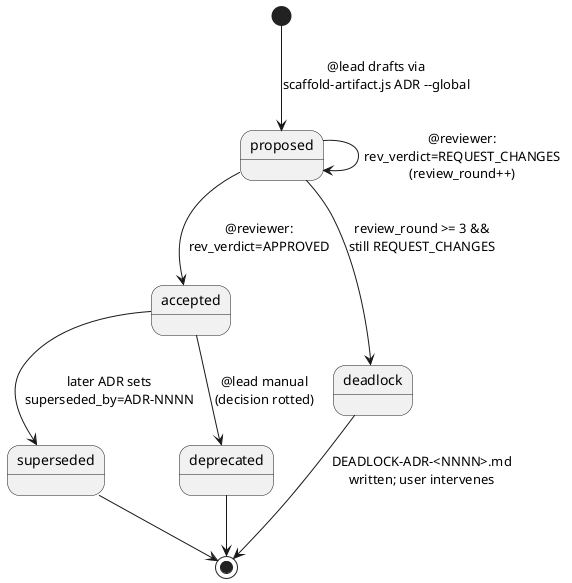

# orchestra v2.0.0 — Document-Output Overhaul Design

> Output of `/sc:sc-design`. Specifies the v2.0.0 collapse of the pipeline artifact canon (14→12), the scaffold-then-fill template engine, the sidecar provenance model, the mandatory-PlantUML diagram set, and the new ADR workflow. **No code, no prompt prose** — those land in `/sc:sc-implement` PRs #1..#7 per §12.

---

## 0. Scope and frame <a id="S-SCOPE-001"></a>

| In scope | Out of scope |
|---|---|
| 12 canonical artifact types + 1 conditional (ADR) + 1 brief variant (INTENT-mode CHARTER) | Specialist v1.1+ agents (already deferred per `DESIGN-002-leaves`) |
| Scaffold-then-fill engine (`scripts/scaffold-artifact.js` + 13 templates under `schemas/templates/`) | New runtime hooks beyond the hash-stamper extension |
| Sidecar provenance (`<artifact>.lock.yaml`) replacing inline `sections:`/`references:` frontmatter | Drift-detection algorithm changes (v1.0.0 walk preserved; only the read source moves to lockfile) |
| Mandatory diagram set per artifact type (use-case, C4 L1/L2/L3, sequence, ER, state-machine, service-contract, DAG, deploy/rollback) | Auto-rendering: agents invoke the cloned `/plantuml` skill explicitly; no auto-render hook |
| Two cloned skills (`skills/plantuml/`, `skills/c4-architecture/`) — the latter rewritten for PlantUML output | Mermaid output (rejected — single-tool discipline per Q2) |
| ADR pattern (Michael Nygard, global flat numbering at `architecture/decisions/`) with lead-proposes-reviewer-reviews 3-round bounded loop | Cross-feature ADR rollups, ADR-superseding-tooling (deferred to v2.1) |
| TSR fold (VERDICT + CODE-REVIEW → single artifact, single-writer-per-section discipline) | Fully merged TSR authorship — sections remain single-writer |
| 6 schema-declared but routing-orphaned types dropped: `DOC`, `IMPL-NOTES`, `IMPL-BE`, `IMPL-FE`, `CODE-DESIGN-BE`, `CODE-DESIGN-FE`, `COMMIT-MSG-as-file` | Re-introducing them in v2.x — dropped, not deferred |
| MAJOR version bump 1.0.0→2.0.0 with no migration path | v1.x compatibility layer (Q7 — accepted breakage) |

### Locked inputs

- **Q1=aggressive** — fold to 12+ADR canon
- **Q2=svg-embed** — PlantUML source `.puml` rendered to `.svg`, embedded via relative-path Markdown image link
- **Q3=sidecar** — provenance moves to `<artifact>.lock.yaml`
- **Q4=usecase-mandatory** — every FRS carries a use-case PlantUML even for tiny features
- **Q5=omit-rule** — state-machine in TDD allowed `<!-- OMIT: no lifecycle states -->` when no lifecycle exists; ADR state-machine MANDATORY
- **Q6=scripts-first** — `scripts/scaffold-artifact.js` writes the structural frame; agents fill `<!-- FILL: -->` spans only
- **Q7=no-migration** — clean break; legacy v1.x consumer projects rerun from intent
- **Q-ADR-1=global-flat** — `ADR-<NNNN>-<slug>.md` global sequence at `architecture/decisions/` (per Nygard convention)
- **H1=only-when-paired** — hash-stamper writes lockfile only if it already exists (signal of scaffold-managed artifact)
- **H2=drop-6-types** — schema cleanup of routing-orphans; canon = what's actually emitted
- **H3=no-render-script** — agents invoke cloned `/plantuml` skill explicitly; hash-stamper extends to whole-file hash `.puml` + `.svg`
- **H4=lead-proposes-reviewer-reviews** — ADR is a 2-agent dialogue with 3-round circuit breaker (`DEADLOCK-ADR-<NNNN>.md`)
- **H5=clone-2-skills** — `skills/plantuml/` (full clone, examples/ trimmed) + `skills/c4-architecture/` (structure cloned, output rewritten Mermaid→PlantUML stdlib)
- **H6=validator-only** — soft-cap warnings exit 0 by default; `--strict` makes warnings fatal
- **Q-NEW-1=B-with-id-charter** — single CHARTER template with `mode: full|brief` field; filename `<NNN>-CHARTER.md` (matches schema's `<feature_id>-<TYPE>` rule)
- **Q-NEW-2=trim-examples** — strip `skills/plantuml/examples/` to zero on clone; verify upstream license MIT-compat in PR #2

---

## 1. Canonical artifact set <a id="S-CANON-001"></a>

| SDLC phase | Always-present | Conditional / exception |
|---|---|---|
| Planning | `intent.yaml` (machine), `<NNN>-CHARTER.md` (mode:full\|brief) | — |
| Analysis | `<NNN>-PRD.md`, `<NNN>-FRS.md` | ADR-fork |
| Design | `SAD.md` (singleton), `<NNN>-TDD.md`, `<NNN>-API.openapi.yaml`, `<NNN>-CONTRACT.md` | ADR-fork |
| Development | `<NNN>-TASKS.md` | — |
| Testing | `<NNN>-TEST.md`, `<NNN>-TSR.md` | — |
| Deployment | `RELEASE-vX.Y.Z.md`, `RUNBOOK-vX.Y.Z.md` | — |
| (cross-cutting) | — | `ADR-<NNNN>-<slug>.md` (global flat numbering at `architecture/decisions/`) |
| (exception types, unchanged from v1.0.0) | — | `ESCALATE-*.md`, `ESCALATE-ARCH-*.md`, `ESCALATE-ADR-<NNNN>.md` (NEW), `DEADLOCK-*.md`, `DEADLOCK-ADR-<NNNN>.md` (NEW), `SUMMARY-*.md`, `INTENT-<id>.md` (template/docs intents) |

**Net change vs v1.0.0**: `VERDICT`+`CODE-REVIEW`→`TSR`; `ANNOUNCEMENT-<NNN>.md`→`RELEASE §S-ANNOUNCEMENT-001`; new `<NNN>-CHARTER.md`; new `ADR-<NNNN>-<slug>.md`; drop `DOC`, `IMPL-NOTES`, `IMPL-BE`, `IMPL-FE`, `CODE-DESIGN-BE`, `CODE-DESIGN-FE`, `COMMIT-MSG-as-file`.

### Folder layout under `<project>/.claude/.orchestra/`

```
.claude/.orchestra/
├── architecture/
│   ├── SAD.md                                  # singleton
│   ├── SAD.lock.yaml
│   ├── diagrams/
│   │   ├── sad-c4-context.{puml,svg}
│   │   └── sad-c4-container.{puml,svg}
│   └── decisions/                              # NEW (global ADRs)
│       ├── ADR-0001-<slug>.md
│       ├── ADR-0001-<slug>.lock.yaml
│       └── diagrams/
│           ├── adr-0001-status.{puml,svg}      # MANDATORY (per §6)
│           └── adr-0001-option-{A,B,C}.{puml,svg}  # OPTIONAL
├── runbooks/RUNBOOK-vX.Y.Z.md (+ .lock.yaml + diagrams/)
├── releases/RELEASE-vX.Y.Z.md (+ .lock.yaml)
└── pipeline/<NNN>-<slug>/
    ├── intent.yaml
    ├── charter/<NNN>-CHARTER.md (+ .lock.yaml)             # NEW
    ├── requirements/
    │   ├── <NNN>-PRD.md (+ .lock.yaml)
    │   ├── <NNN>-FRS.md (+ .lock.yaml)
    │   └── diagrams/frs-usecase.{puml,svg}
    ├── interfaces/
    │   ├── <NNN>-API.openapi.yaml (+ .lock.yaml)
    │   ├── <NNN>-CONTRACT.md (+ .lock.yaml)
    │   └── diagrams/{contract-service,contract-sequence-<crit>}.{puml,svg}
    ├── design/
    │   ├── <NNN>-TDD.md (+ .lock.yaml)
    │   └── diagrams/{tdd-c4-component,tdd-sequence-<flow>,tdd-er,tdd-state-<lifecycle>}.{puml,svg}
    ├── plan/
    │   ├── <NNN>-TASKS.md (+ .lock.yaml)
    │   └── diagrams/tasks-dag.{puml,svg}
    ├── verify/
    │   ├── <NNN>-TEST.md (+ .lock.yaml)
    │   └── <NNN>-TSR.md (+ .lock.yaml)                     # FOLDED
    └── (deployment artifacts go to release-time singletons above)
```

---

## 2. Per-type schema specs <a id="S-SCHEMAS-001"></a>

For each type, the locked anchor set, diagram-slot list, frontmatter shape, and soft-cap is the contract enforced by `validate.js` structural-diff mode (§6).

### 2.1 Common skeleton

```markdown
---
id: <NNN>-<TYPE>                    # or ADR-<NNNN> / SAD / RELEASE-vX.Y.Z
type: <TYPE>
created: <ISO-8601>
revision: 1
status: <type-specific enum>
version: <semver>                   # CHARTER/PRD/RELEASE/RUNBOOK only
# (no `sections:`, no `references:` — moved to `<artifact>.lock.yaml`)
---

# <Title> — <TYPE>

## <Section1> <a id="S-<TYPE>-001"></a>

<!-- FILL: <one-line guidance> -->
```

### 2.2 Type table

| Type | Anchors | Required diagrams | Soft cap |
|---|---|---|---:|
| `<NNN>-CHARTER.md` (mode:full) | `S-PROBLEM-001`, `S-SCOPE-001`, `S-FEASIBILITY-001`, `S-DECISION-001` | none | 50 |
| `<NNN>-CHARTER.md` (mode:brief) | `S-INTENT-001`, `S-DECISION-001` | none | 20 |
| `<NNN>-PRD.md` | `S-PROBLEM-001`, `S-USERS-001`, `S-GOALS-001`, `S-NON-GOALS-001`, `S-METRICS-001`, `S-OPEN-001` | none | 120 |
| `<NNN>-FRS.md` | `S-FRS-001`, `S-ACCEPTANCE-001`, `S-ERRORS-001`, `S-USECASE-001` | use-case (`diagrams/frs-usecase.puml/svg`) | 100+diag |
| `SAD.md` | `S-VISION-001`, `S-CONTEXT-001`, `S-CONTAINERS-001`, `S-ADR-INDEX-001` | C4 L1, C4 L2 | 200+diag |
| `<NNN>-TDD.md` | `S-COMPONENTS-001`, `S-SEQUENCE-001`, `S-DATA-MODEL-001`, `S-STATE-001`, `S-ERROR-HANDLING-001`, `S-CONFIG-001`, `S-RISKS-001` | C4 L3, ≥1 sequence, ER, state-machine *(or `<!-- OMIT -->`)* | 250+diag |
| `<NNN>-API.openapi.yaml` | (whole-file, no anchor walk) | none | n/a |
| `<NNN>-CONTRACT.md` | `S-INTERFACE-001`, `S-SERVICE-CONTRACT-001`, `S-SCORING-001`, `S-CRITERIA-001` | service-contract, sequence per critical-path | 300 |
| `<NNN>-TASKS.md` | `S-DAG-001`, `S-TASKS-001` | DAG (PlantUML activity) | 60+diag |
| `<NNN>-TEST.md` | `S-COVERAGE-001` | none (probe defs live in CONTRACT) | 200 |
| `<NNN>-TSR.md` | `S-EVAL-VERDICT-001`, `S-EVAL-TABLE-001`, `S-REV-VERDICT-001`, `S-REV-FINDINGS-001`, `S-SHIP-001` | none | 150 |
| `RELEASE-vX.Y.Z.md` | `S-WHATSNEW-001`, `S-ENDPOINTS-001`, `S-CONFIG-001`, `S-BREAKING-001`, `S-GATES-001`, `S-KNOWN-001`, `S-ANNOUNCEMENT-001` | none | 120 |
| `RUNBOOK-vX.Y.Z.md` | `S-OVERVIEW-001`, `S-LIFECYCLE-001`, `S-DEPLOY-001`, `S-ROLLBACK-001`, `S-HEALTH-001`, `S-FAILURE-001`, `S-LOGS-001`, `S-ENVVARS-001` | deploy activity, rollback activity | 180+diag |
| `ADR-<NNNN>-<slug>.md` | `S-STATUS-001`, `S-CONTEXT-001`, `S-DECISION-001`, `S-CONSEQUENCES-001`, `S-ALTERNATIVES-001` | state-machine **MANDATORY**, optional per-option sketches | 100+diag |

### 2.3 Type-specific frontmatter (post-sidecar)

```yaml
# CHARTER
mode: full | brief
status: draft | approved | rejected
decision: GO | NO-GO | DEFERRED

# PRD (unchanged from v1.0.0)
status: planned | in-flight | shipped | abandoned
version: <semver>

# FRS
prd: PRD-<id>
acceptance_criteria_count: <int>
usecase_count: <int>                 # NEW

# TDD
sad-touched: true | false
c4_levels_present: [3]               # changed from [3,4] — Level 4 dropped
sequence_diagram_count: <int>        # NEW
state_machine_count: <int>           # NEW (0 when omitted)

# CONTRACT (unchanged)
signed: true | false
weighted_criteria_total: 100
passing_score: <int>
probe_count: <int>
critical_failure_conditions: <int>

# TSR (NEW; replaces VERDICT + CODE-REVIEW frontmatter)
eval_verdict: PASS | FAIL | pending
eval_score: <int>
rev_verdict: APPROVED | REQUEST_CHANGES | pending
rev_round: <1..3>
ship: ALLOW | HOLD | pending

# ADR (NEW)
status: proposed | accepted | superseded | deprecated
superseded_by: ADR-<NNNN> | null
triggered_by: <PRD-NNN | FRS-NNN | TDD-NNN | SAD>
review_round: <1..3>
option_count: <int>
```

---

## 3. Provenance sidecar <a id="S-LOCKFILE-001"></a>

Every scaffold-managed artifact gets a paired `<artifact>.lock.yaml` written by `scripts/scaffold-artifact.js` at scaffold time and mutated by the `hash-stamper` hook on every subsequent `Write`/`Edit`.

### 3.1 Lockfile shape

```yaml
artifact_id: <ID>                    # mirrors artifact frontmatter id
artifact_path: <relative-path>       # e.g., pipeline/001-foo/requirements/001-PRD.md
schema_revision: 1
sections:
  S-<TYPE>-NNN:
    hash: "sha256:..."
    confirmed: true                  # mutually exclusive with inferred:
    # inferred: true
references:
  - type: <upstream-type>
    id: <feature-id>                 # "" for singletons (sad/release/runbook)
    section: S-<TYPE>-NNN
    hash-at-write: "sha256:..."
diagrams:
  - kind: usecase | c4-context | c4-container | c4-component | sequence | er | state | service-contract | dag | deploy | rollback | option | adr-status
    source: diagrams/<filename>.puml
    rendered: diagrams/<filename>.svg
    source_hash: "sha256:..."
    rendered_hash: "sha256:..."      # "sha256:UNRENDERED" allowed when PlantUML missing
    omit: false                      # true when body has <!-- OMIT: ... -->
```

### 3.2 Grammar constraint

Lockfiles MUST round-trip through `hooks/lib/yaml-mini.js` (the in-house frozen-grammar parser). Block-style only; no flow style; key regex `/^([a-zA-Z][a-zA-Z0-9_-]*):/`. Any divergence is a `lockfile-grammar` validator failure.

### 3.3 Doc frontmatter post-sidecar

Doc frontmatter retains only: `id`, `type`, `created`, `revision`, `status` (where applicable), `version` (where applicable), and any type-specific minimal fields enumerated in §2.3. **No `sections:`. No `references:`.** This is the breaking change v1→v2.

---

## 4. Scaffold-then-fill engine <a id="S-SCAFFOLD-001"></a>

### 4.1 CLI

```
node scripts/scaffold-artifact.js <type> <feature-id|--singleton|--global|--version=v…> [<slug>] [--mode=full|brief] [--cwd=<path>] [--force]
```

| Invocation | Output |
|---|---|
| `scaffold-artifact.js PRD 001-foo foo` | `pipeline/001-foo/requirements/001-PRD.md` + `.lock.yaml` + `diagrams/.gitkeep` |
| `scaffold-artifact.js CHARTER 001-foo foo --mode=full` | `pipeline/001-foo/charter/001-CHARTER.md` (full mode) + `.lock.yaml` |
| `scaffold-artifact.js CHARTER 001-foo foo --mode=brief` | same path, brief-mode template (only S-INTENT + S-DECISION anchors) |
| `scaffold-artifact.js SAD --singleton` | `architecture/SAD.md` + `.lock.yaml` + `diagrams/` (with C4 L1+L2 stub `.puml`) |
| `scaffold-artifact.js ADR --global "use-sqlite-not-postgres"` | next-NNNN auto-computed; writes `architecture/decisions/ADR-<NNNN>-use-sqlite-not-postgres.md` + `.lock.yaml` + `diagrams/adr-<NNNN>-status.puml` (state-machine stub) |
| `scaffold-artifact.js RELEASE --version=v0.1.0` | `releases/RELEASE-v0.1.0.md` + `.lock.yaml` |
| `scaffold-artifact.js TSR 001-foo foo` | `pipeline/001-foo/verify/001-TSR.md` (anchors for both eval and rev halves; both `<!-- FILL -->`) + `.lock.yaml` |

### 4.2 Exit codes

| Code | Meaning |
|---|---|
| 0 | Success |
| 1 | Unknown type |
| 2 | Output already exists (use `--force`) |
| 3 | Template missing under `schemas/templates/` |
| 4 | ID collision (existing folder mismatch / ADR slug collision) |
| 5 | Output path outside `<cwd>/.claude/.orchestra/` |
| 6 | Invalid combination (e.g., `--global` for non-ADR type) |

### 4.3 Idempotency

**Refuse if exists by default.** With `--force`: overwrite both `.md` and `.lock.yaml`. **No merge** — partial-fill detection is fragile. Authors who want incremental progress should use `Edit` on existing `<!-- FILL: -->` spans, not re-scaffold.

### 4.4 Templates

13 templates under `schemas/templates/<TYPE>.template.md` (CHARTER serves both `mode:full` and `mode:brief` via conditional anchor blocks; rendering picks the relevant subset). One additional template `schemas/templates/_lockfile.template.yaml` ships the empty lockfile shape.

Substitution variables: `{{ID}}`, `{{TYPE}}`, `{{CREATED}}` (today's ISO-8601), `{{FEATURE_ID}}`, `{{SLUG}}`, `{{NNNN}}` (ADR only), `{{MODE}}` (CHARTER only).

### 4.5 ID computation rules

| Type class | Computation |
|---|---|
| Feature-scoped (PRD, FRS, TDD, CONTRACT, API, TASKS, TEST, TSR, CHARTER) | Numeric prefix from `<feature-id>` ("001-foo" → "001"), filename `<NNN>-<TYPE>.<ext>` |
| Project singleton (SAD) | Fixed `SAD.md` |
| Version singleton (RELEASE, RUNBOOK) | `<TYPE>-<version>.md` |
| Global (ADR) | Read `architecture/decisions/ADR-*.md` → next 4-digit NNNN; require kebab-case `<slug>` matching `[a-z][a-z0-9-]*` |

---

## 5. Cloned skills (PlantUML rendering primitive) <a id="S-SKILLS-001"></a>

### 5.1 `skills/plantuml/` — full clone

- Source: `.agents/skills/plantuml/` (untracked staging dir in this repo)
- Trim: drop `examples/` directory entirely; remove "Converting Source Code to Diagrams" section from cloned `SKILL.md` (lines 160-178); update `references/` cross-links accordingly. Verify body stays under the 400-line skill cap (currently 325 — comfortable margin even before trim).
- Add `origin:` frontmatter field (required by `validate.js:105`). **Block PR #2** until upstream license is confirmed MIT-compatible (read `CHANGELOG.md` + `FINAL_SUMMARY.md` in source dir for upstream URL).
- Ships its own `scripts/convert_puml.py`, `scripts/process_markdown_puml.py`, `scripts/check_setup.py`. Java + plantuml.jar runtime dep documented in skill body.

### 5.2 `skills/c4-architecture/` — structure cloned, output rewritten

- Source: `.agents/skills/c4-architecture/SKILL.md` (296 lines)
- Same workflow + level table + element-syntax structure, but every example block switches from ` ```mermaid C4Context ` to ` ```plantuml @startuml \n!include <C4/C4_Container> ` etc.
- C4-PlantUML stdlib include directives documented at top of skill body.
- Output-location section: change from skill's default `docs/architecture/` to **artifact's `diagrams/` folder** (skill is invoked by orchestra agents writing into pipeline dirs).
- `origin: orchestra-internal` frontmatter (structural skeleton retained from upstream; output dialect is original work).

### 5.3 Agent invocation contract

Agents that produce diagram-bearing artifacts (`@product`, `@lead`, `@backend`, `@frontend`, `@ship`) carry an instruction line in their bodies:

> "For C4 diagrams use the `/c4-architecture` skill. For any other PlantUML diagram (use-case, sequence, ER, state, activity, service-contract) use the `/plantuml` skill. Both skills produce `.puml` source; render to `.svg` via the skill's `convert_puml.py` script in the same `diagrams/` directory."

No auto-render hook. Authoring is explicit.

---

## 6. ADR workflow <a id="S-ADR-001"></a>

### 6.1 State machine (PlantUML — mandatory diagram for every ADR)



### 6.2 Authorship discipline

| Stage | Owner | Action |
|---|---|---|
| Open | `@lead` | `Bash(scaffold-artifact.js ADR --global <slug>)`. Edit `S-CONTEXT-001`, `S-DECISION-001`, `S-ALTERNATIVES-001`. Set frontmatter `status: proposed`, `review_round: 1`, `triggered_by: <upstream-type>-<NNN>`. Author state-machine `.puml` (use the §6.1 template); invoke `/plantuml` to render. |
| Review | `@reviewer` | Read ADR. Either: (a) Edit `S-CONSEQUENCES-001` with findings + set frontmatter `rev_verdict: REQUEST_CHANGES` (returns to lead); (b) set `rev_verdict: APPROVED` + flip `status: accepted` + set `accepted_at: <ISO>`. |
| Iterate | `@lead` | On REQUEST_CHANGES: address findings, bump `review_round`. Loop. |
| Circuit breaker | (model-emitted) | At `review_round = 3` with still REQUEST_CHANGES: `Write(DEADLOCK-ADR-<NNNN>.md)`, halt. User intervenes. |
| Index | `@lead` | On `accepted`: append a one-line entry to `SAD §S-ADR-INDEX-001` table (id, slug, status, accepted_at). |

### 6.3 Triggers

| Trigger | Source | Mechanism |
|---|---|---|
| Open Question in PRD `S-OPEN-001` flagged ADR-worthy by `@product` | One-line note in PRD | `@lead` reads on next stage; opens ADR if upstream decision required |
| Design fork in TDD §S-RISKS-001 | `@lead` self-flag | Direct ADR-open |
| SAD container-level fork | `@lead` self-flag | Direct ADR-open; sets TDD `sad-touched: true` |
| Implementer hits architectural fork mid-impl | `@backend` / `@frontend` | `Write(ESCALATE-ADR-<NNNN>.md)` (NEW exception type) — triggers `@lead` to open ADR |
| Reviewer spots undocumented decision | `@reviewer` | `Write(ESCALATE-ADR-<NNNN>.md)` — same path |

### 6.4 Cross-reference rule

ADRs are referenced **bidirectionally via lockfile only** — no inline `per ADR-NNNN` cites in PRD/FRS/TDD bodies. The lockfile's `references[]` block carries `{type: adr, id: "ADR-<NNNN>", section: S-DECISION-001, hash-at-write: ...}`. This avoids the project CLAUDE.md "no annotation creep" anti-pattern.

---

## 7. TSR co-authorship discipline <a id="S-TSR-001"></a>

### 7.1 Tier-A invariant preserved

The fold creates a real authorship conflict: two T-A agents (`@evaluator`, `@reviewer`) write into the same file. Resolution is **single-writer-per-section** with strict anchor ownership:

| Section | Sole writer | Frontmatter field set |
|---|---|---|
| `S-EVAL-VERDICT-001` | `@evaluator` | `eval_verdict`, `eval_score` |
| `S-EVAL-TABLE-001` | `@evaluator` | (none — table only) |
| `S-REV-VERDICT-001` | `@reviewer` | `rev_verdict`, `rev_round` |
| `S-REV-FINDINGS-001` | `@reviewer` | (none — findings only) |
| `S-SHIP-001` | `@ship` | `ship` |

### 7.2 Sequencing

`@lead` calls `scaffold-artifact.js TSR <feature-id> <slug>` at TSR-stage init — TSR.md is created with all 5 anchors and `<!-- FILL -->` spans. `@evaluator` runs first per existing `feature` routing order, edits only S-EVAL-* spans. `@reviewer` runs next, edits only S-REV-* spans. `@ship` runs last, reads `eval_verdict` + `rev_verdict` from frontmatter and writes `S-SHIP-001`. Validator structural-diff catches violations (any agent writing outside its section ownership = test fail).

### 7.3 Resume-pipeline derivation update

Per `skills/resume-pipeline/SKILL.md` revision in §11:
- `@evaluator.done ⟺ TSR.eval_verdict ∈ {PASS, FAIL}`
- `@reviewer.done ⟺ TSR.rev_verdict ∈ {APPROVED, REQUEST_CHANGES}`
- `@lead.done` (for ADR-open subroutine) `⟺ ADR.status ∈ {accepted, deprecated}` OR `DEADLOCK-ADR-<NNNN>.md` exists

---

## 8. Hash-stamper sidecar mode <a id="S-HASHSTAMPER-001"></a>

Per `DESIGN-001-infra §S-HOOKS-001`, the hash-stamper hook fires on `PreToolUse:Write|Edit|MultiEdit` and currently rewrites the artifact's inline frontmatter `sections:` and `references[].hash-at-write` blocks. v2.0.0 changes this to write to the sidecar lockfile.

### 8.1 Detection logic (only-when-paired per H1)

```
if filePath ends in .md or .openapi.yaml under .orchestra/:
    lockfile_path = filePath.replace(/\.(md|openapi\.yaml)$/, ".lock.yaml")
    if exists(lockfile_path):
        # Scaffold-managed artifact — sidecar mode
        compute hashSections(body)            # via hooks/lib/section-hash.js (unchanged)
        read lockfile via yaml-mini parse
        update sections[].hash for each anchored S-ID
        resolve references[].hash-at-write where TBD via lookup in upstream lockfile
        write lockfile
        passthrough Write of original artifact (no body mutation)
    else:
        # Hand-authored or pre-v2 artifact — passthrough untouched (no lockfile write)
        passthrough

if filePath ends in .puml or .svg under .orchestra/:
    artifact_lockfile = find_paired_artifact_lockfile(filePath)   # walk up dir; match diagrams[].source or .rendered
    if exists(artifact_lockfile):
        compute SHA256 of whole .puml or .svg file
        update diagrams[<matching kind>].source_hash or .rendered_hash
        write lockfile
    passthrough
```

### 8.2 Section-hash extension

`hooks/lib/section-hash.js` gains one helper:
```js
export function hashFile(absPath) { /* whole-file SHA256 */ }
```
Existing `hashSections(body)` for anchor-walking is unchanged.

### 8.3 Never-block invariant preserved

On any error (parse failure, lockfile missing on a referenced upstream, file not found): emit passthrough `permissionDecision: allow` per `DESIGN-001-infra §S-HOOKS-001` contract. Hash-stamper is never a write-blocker.

---

## 9. Validator extensions <a id="S-VALIDATOR-001"></a>

### 9.1 New modes added to `scripts/validate.js`

| Mode | What it checks | Failure shape |
|---|---|---|
| `structural-diff` | Every artifact's H2 anchor set matches `schemas/templates/<TYPE>.template.md` exactly (no additions, no deletions) | `<path>: structural-drift — missing-anchors=[...] extra-anchors=[...]` |
| `lockfile-presence` | Every scaffold-managed artifact has paired `.lock.yaml` (heuristic: presence of `<!-- FILL: -->` markers OR `confirmed: true` mentions in body history → require lockfile) | `<path>: missing-lockfile` |
| `lockfile-grammar` | `.lock.yaml` round-trips through `yaml-mini`; required keys present (`artifact_id`, `artifact_path`, `schema_revision`, `sections`, `references`, `diagrams`) | `<path>.lock.yaml: <reason>` |
| `diagram-source-presence` | Every `diagrams[]` entry: source file exists; `source_hash` matches recomputed | `<path>: diagram-source-drift kind=<X>` |
| `diagram-rendered-presence` | Every `diagrams[]` entry where `omit: false`: rendered file exists; `rendered_hash` matches recomputed (or equals `"sha256:UNRENDERED"` in non-strict mode) | `<path>: diagram-rendered-drift kind=<X>` |
| `orphan-types` | No `*-VERDICT.md`, `*-CODE-REVIEW.md`, `ANNOUNCEMENT-*.md`, `*-IMPL-NOTES.md`, `*-IMPL-{BE,FE}.md`, `*-CODE-DESIGN-{BE,FE}.md` exists under `<cwd>/.claude/.orchestra/` | `<path>: orphan-type — folded/dropped per v2.0` |
| `fold-correctness` | Every TSR has both `S-EVAL-VERDICT-001` + `S-REV-VERDICT-001` anchors; every RELEASE has `S-ANNOUNCEMENT-001` | `<path>: fold-violation — missing <anchor>` |
| `soft-cap` (non-blocking warning) | Body line count exceeds the per-type soft cap from §2.2 | `<path>: WARN soft-cap — <N> lines > <cap> for type <TYPE>` (exit 0 unless `--strict`) |
| `leaky-cite` (existing — extended walk) | `findLeakyCites` extends to `schemas/templates/` | unchanged shape |

### 9.2 Mutation tests (added to `if (isMain)` block)

10 new mutations: M11 missing-anchor, M12 extra-anchor, M13 missing-lockfile, M14 wrong-shape lockfile, M15 modified-puml-stale-hash, M16 missing-svg, M17 orphan-VERDICT, M18 TSR-missing-rev-anchor, M19 RELEASE-missing-announcement, M-inverse clean-fixture-passes.

### 9.3 Performance budget

Validator must finish under 5s on a 50-artifact consumer install. Anchor-set diff is O(N) per file; lockfile parse is `yaml-mini` (~10ms/file). Diagram-hash recompute is heaviest — gated behind `--with-diagrams` flag; default mode trusts `.lock.yaml` and defers heavy hash recompute to `validate-drift.js`.

---

## 10. Routing-taxonomy update <a id="S-ROUTING-001"></a>

`schemas/routing-taxonomy.md` updates per intent:

| Intent | Add | Remove | Notes |
|---|---|---|---|
| `feature` | `<NNN>-CHARTER.md` (mode:full), `<NNN>-TSR.md`, conditional ADR sub-flow | `<NNN>-VERDICT.md`, `<NNN>-CODE-REVIEW.md`, `ANNOUNCEMENT-vX.Y.Z.md` | TSR replaces 2; ANNOUNCEMENT folds into RELEASE |
| `hotfix` | `<NNN>-TSR.md` | `<NNN>-VERDICT.md` | No CHARTER (hotfix skips Planning) |
| `template` | `<NNN>-CHARTER.md` (mode:brief — replaces today's `INTENT-<id>.md`), `<NNN>-TSR.md` | `<NNN>-VERDICT.md`, `<NNN>-CODE-REVIEW.md`, `INTENT-<id>.md` | CHARTER mode:brief subsumes the brief-classification slot |
| `refactor` | `<NNN>-TSR.md`, conditional ADR | `<NNN>-VERDICT.md`, `<NNN>-CODE-REVIEW.md` | ADRs valuable here (refactor often hits forks) |
| `docs` | `<NNN>-CHARTER.md` (mode:brief) | `<NNN>-CODE-REVIEW.md` (folded if any review) | Light; no TSR for pure docs |
| `review-only` | (no change beyond rename) | `<NNN>-CODE-REVIEW.md` → `<NNN>-TSR.md` (rev half only) | Eval half left `pending` indefinitely |

`@lead` MUST refuse `docs` and `review-only` if spawned; existing rule preserved.

---

## 11. Agent + skill edit list <a id="S-EDITS-001"></a>

### 11.1 Agents (8 files)

| Agent | Change scope | Specifics |
|---|---|---|
| `agents/product.md` | major | Switch PRD/FRS/CHARTER from freehand to scaffold-fill via `Bash(scaffold-artifact.js …)` then `Edit(<!-- FILL --> spans)`. Author use-case `.puml`; invoke `/plantuml`. Flag PRD §S-OPEN-001 items as ADR-worthy. |
| `agents/lead.md` | major | Switch SAD/CONTRACT/TDD/TASKS to scaffold-fill. Add ADR-open subroutine (§6.2). Replace SAD `S-ADR-0001` body slot with `S-ADR-INDEX-001` index-table writing. SAD-touched detection on container-level ADR. |
| `agents/backend.md` | minor | Add `Write(ESCALATE-ADR-<NNNN>.md)` trigger on architectural forks during impl. |
| `agents/frontend.md` | minor | Same as backend. |
| `agents/test.md` | moderate | Switch TEST.md to scaffold-fill. Trim body to coverage matrix only; replace probe re-statements with reference to CONTRACT. |
| `agents/evaluator.md` | significant | Stop authoring `verify/<NNN>-VERDICT.md`. Edit only `S-EVAL-*` anchors in TSR.md (created upstream by `@lead`). Set frontmatter `eval_verdict`, `eval_score`. Tier-A: never touch `S-REV-*`. |
| `agents/reviewer.md` | significant | Stop authoring `verify/<NNN>-CODE-REVIEW.md`. Edit only `S-REV-*` anchors. Set `rev_verdict`, `rev_round`. Add `Write(ESCALATE-ADR-<NNNN>.md)` retroactive flag. ADR-review subroutine (§6.2). |
| `agents/ship.md` | moderate | Drop ANNOUNCEMENT.md; write `S-ANNOUNCEMENT-001` inside RELEASE. Update gate-check reads from VERDICT/CODE-REVIEW → TSR frontmatter. Switch RELEASE/RUNBOOK to scaffold-fill. |

### 11.2 Skills (11 existing + 2 new = 13)

| Skill | Change scope | Specifics |
|---|---|---|
| `skills/code-review/SKILL.md` | rename | Output target: `verify/<NNN>-CODE-REVIEW.md` → TSR `S-REV-VERDICT-001` + `S-REV-FINDINGS-001`. |
| `skills/commit-work/SKILL.md` | minor | Read TSR not VERDICT/CODE-REVIEW. |
| `skills/cut-release/SKILL.md` | moderate | Drop ANNOUNCEMENT step; fold into RELEASE §S-ANNOUNCEMENT-001. Read TSR. |
| `skills/evaluator-tuning/SKILL.md` | minor | Calibration anchor injects into TSR S-EVAL-* span path. |
| `skills/java-source-intel/SKILL.md` | none | Read-only impact analysis; no path coupling. |
| `skills/project-discovery/SKILL.md` | moderate | New step: scaffold `<NNN>-CHARTER.md` post-discovery. |
| `skills/qa-test-planner/SKILL.md` | moderate | Trim probe-DSL re-statement; coverage-matrix only. |
| `skills/resume-pipeline/SKILL.md` | significant | New T-A done-derivations per §7.3; new `@lead` derivation for ADR. |
| `skills/shutdown-team/SKILL.md` | none | SUMMARY logic unchanged. |
| `skills/task-breakdown/SKILL.md` | moderate | Switch to scaffold-fill. Add DAG `.puml` authoring step. |
| `skills/write-contract/SKILL.md` | significant | Switch to scaffold-fill. Add service-contract diagram + sequence-per-critical authoring. |
| `skills/plantuml/SKILL.md` | NEW (cloned) | Full clone, examples/ trimmed (Q-NEW-2). License check blocks PR #2 until verified MIT-compat. |
| `skills/c4-architecture/SKILL.md` | NEW (cloned, output rewritten) | Structure cloned from `.agents/skills/c4-architecture/`; all examples switched Mermaid → PlantUML C4-PlantUML stdlib. `origin: orchestra-internal`. |

### 11.3 Schemas + commands + manifest

| File | Change |
|---|---|
| `schemas/pipeline-artifact.schema.md` | major rewrite: drop inline `sections:`/`references:`; drop 6 routing-orphan types; add CHARTER/ADR/TSR sections; revise filename rules with ADR carve-out |
| `schemas/lockfile.schema.md` | NEW: normative spec for sidecar (§3) |
| `schemas/routing-taxonomy.md` | per-intent renames per §10 |
| `schemas/templates/<13>.md` + `_lockfile.template.yaml` | NEW: scaffold sources |
| `commands/orchestra.md` | Step 6 line: replace "Agents author their artifact frontmatter… per `schemas/pipeline-artifact.schema.md`" → "Agents call `scaffold-artifact.js` then fill placeholders; provenance auto-emits to `<artifact>.lock.yaml`" |
| `.claude-plugin/plugin.json` | bump `"version": "2.0.0"`; add `"./skills/plantuml/SKILL.md"` and `"./skills/c4-architecture/SKILL.md"` to `agents`/`skills` array (the manifest treats skills implicitly via folder; verify) |
| `package.json` | bump `"version"`; add `test:scaffold`, `test:render` (latter only if PR #2 chooses Node wrapper around skill's Python) |
| `VERSION` | `2.0.0` |
| `CHANGELOG.md` | new `## [2.0.0]` entry per §13 |
| `hooks/scripts/hash-stamper.js` | rewrite per §8 |
| `hooks/lib/section-hash.js` | add `hashFile(absPath)` |
| `scripts/validate.js` | add §9 modes + mutation tests |
| `scripts/validate-drift.js` | switch hash-source from frontmatter → `.lock.yaml` |
| `scripts/test-streamline-fixture.sh` | smoke gate for orphan-type absence |

---

## 12. PR sequencing <a id="S-PRPLAN-001"></a>

Strict linear; each PR's tests need the prior PR's primitives.

| PR | Title | Net touches | Smoke gate |
|---|---|---:|---|
| PR #1 | `infra: lockfile schema + hash-stamper sidecar mode` | 5 (schemas/lockfile.schema.md NEW; hooks/scripts/hash-stamper.js rewrite; hooks/lib/section-hash.js +hashFile; scripts/test-hash-stamper.js NEW; scripts/validate-drift.js read-from-lockfile) | unit + drift mutation suite |
| PR #2 | `skills: clone /plantuml + author /c4-architecture (PlantUML output); scaffold-artifact + 13 templates` | 16+ (skills/plantuml/* full clone less examples/; skills/c4-architecture/SKILL.md NEW; schemas/templates/<13>.template.md NEW; schemas/templates/_lockfile.template.yaml NEW; scripts/scaffold-artifact.js NEW; scripts/test-scaffold.js NEW) | scaffold mutation suite + license-compat check |
| PR #3 | `validator: structural-diff + lockfile-presence + orphan-types + fold-correctness + diagram-hash + soft-cap + 10 mutations` | 2 (scripts/validate.js extension; scripts/test-validate-extensions.js NEW) | full validator mutation pass |
| PR #4 | `schema: rewrite pipeline-artifact + routing-taxonomy; drop 6 dead types; add CHARTER/ADR/TSR; folder layout update` | 2 (schemas/pipeline-artifact.schema.md rewrite; schemas/routing-taxonomy.md per-intent rename) | leaky-cite check on rewritten schemas |
| PR #5 | `agents: product/lead/test scaffold-fill + CHARTER + ADR-open subroutine + diagram authoring + invariant fold-up` | 7 (agents/product/lead/test.md; skills/project-discovery/task-breakdown/write-contract/qa-test-planner.md) | test-agents.js tier validation |
| PR #6 | `agents: TSR fold (evaluator/reviewer/ship); drop ANNOUNCEMENT; ESCALATE-ADR + DEADLOCK-ADR exception types` | 8 (agents/evaluator/reviewer/ship.md; skills/code-review/cut-release/commit-work/evaluator-tuning/resume-pipeline.md) | end-to-end smoke against fixture pipeline |
| PR #7 | `release: v2.0.0 — dispatcher Step 6 update + smoke gate + CHANGELOG + version bump` | 6 (commands/orchestra.md Step 6 line; VERSION; package.json; .claude-plugin/plugin.json; CHANGELOG.md; scripts/test-streamline-fixture.sh orphan-type assertion) | full consumer-install 5-step smoke chain (per `feedback_smoke-before-release-docs`) |

**Dependencies**: 1 → 2 → 3 → 4 → 5 → 6 → 7. **Total touches**: ~30 files. **Cumulative LOC change**: estimated ~3000 lines added (templates + scripts + schemas), ~800 lines removed (dropped types + freehand-author prose + 6 orphan declarations).

---

## 13. Version, migration, CHANGELOG <a id="S-VERSION-001"></a>

### 13.1 Version bump

**MAJOR (1.0.0 → 2.0.0)**, NOT patch. Project default in `CLAUDE.md` is PATCH; this overhaul overrides explicitly because:
- Pipeline artifact filenames change (VERDICT.md / CODE-REVIEW.md / ANNOUNCEMENT.md disappear)
- Frontmatter shape changes (sections + references move to sidecar)
- 6 declared types vanish from schema
- No automated migration

### 13.2 Migration

**None.** Per Q7. Legacy v1.x consumer projects rerun from intent. Documented as the v2.0.0 BREAKING entry.

### 13.3 CHANGELOG entry shape (PR #7)

```markdown
## [2.0.0] — 2026-MM-DD

### BREAKING
- Pipeline artifact canon collapsed from 14 → 12 (+ conditional ADRs).
  - `verify/<NNN>-VERDICT.md` + `verify/<NNN>-CODE-REVIEW.md` → folded into `verify/<NNN>-TSR.md`.
  - `ANNOUNCEMENT-vX.Y.Z.md` → folded into `RELEASE-vX.Y.Z.md §S-ANNOUNCEMENT-001`.
  - 6 schema-declared but routing-orphaned types dropped: `DOC`, `IMPL-NOTES`, `IMPL-BE`, `IMPL-FE`, `CODE-DESIGN-BE`, `CODE-DESIGN-FE`. `COMMIT-MSG` is no longer a file artifact (string output of `commit-work` skill only).
  - New: `<NNN>-CHARTER.md` (Planning, mode:full|brief), `ADR-<NNNN>-<slug>.md` (global flat numbering at `architecture/decisions/`).
- Provenance moved from artifact frontmatter to `<artifact>.lock.yaml` sidecar.
- Diagrams MANDATORY per type: use-case, C4, sequence, ER, state-machine (where lifecycle exists), service-contract, DAG, deploy/rollback. PlantUML source rendered to SVG; both hashed in lockfile.
- Authoring switched from freehand markdown to scaffold-then-fill via `scripts/scaffold-artifact.js`. Validator rejects structural drift.
- No migration path. v1.x consumer projects rerun from intent.
- See `docs/DESIGN-005-doc-output-overhaul.md`.

### Added
- `scripts/scaffold-artifact.js` — template engine.
- `schemas/lockfile.schema.md` — sidecar provenance spec.
- 13 templates under `schemas/templates/`.
- ADR pattern (Michael Nygard, global numbering, lead-proposes-reviewer-reviews).
- `skills/plantuml/` (cloned from upstream) + `skills/c4-architecture/` (PlantUML output, structure cloned).

### Changed
- `hooks/scripts/hash-stamper.js` — writes to `.lock.yaml` instead of frontmatter (only-when-paired).
- `hooks/lib/section-hash.js` — adds `hashFile()` for whole-file PlantUML/SVG hashing.
- `scripts/validate.js` — adds 9 new validation modes.
- `schemas/pipeline-artifact.schema.md` — rewritten.
- `schemas/routing-taxonomy.md` — per-intent updates.

### Removed
- Artifact types `VERDICT`, `CODE-REVIEW`, `ANNOUNCEMENT`, `DOC`, `IMPL-NOTES`, `IMPL-BE`, `IMPL-FE`, `CODE-DESIGN-BE`, `CODE-DESIGN-FE`, `COMMIT-MSG-as-file`.
- Inline `sections:` / `references:` blocks from artifact frontmatter.
- Inline probe re-statements in TEST.md (defer to CONTRACT).
```

---

## 14. Open follow-ups <a id="S-FOLLOWUPS-001"></a>

| # | Status | Item |
|---|---|---|
| F-1 | PR #2 author task | Verify upstream license of `.agents/skills/plantuml/` is MIT-compatible. Block PR #2 if not. Capture URL + license in cloned `skills/plantuml/SKILL.md` `origin:` field. |
| F-2 | PR #2 author task | Trim `examples/` from cloned plantuml skill; verify SKILL.md body stays under 400-line cap; update `references/` cross-links. |
| F-3 | PR #1 author task | Decide hash-stamper handling for `.openapi.yaml`: current v1.0 PR-#2 comment in source says "passthrough until API artifacts ship in PR #5+". For v2.0, this is the moment — implement whole-file hash for OpenAPI lockfiles. |
| F-4 | PR #2 author task | `scaffold-artifact.js`'s ADR `--global` mode reads `architecture/decisions/ADR-*.md` to compute next NNNN. Concurrent invocations could race. Out of scope for v2.0 (single-writer assumption per existing `commands/orchestra.md` pipeline plumbing); document as a known limitation. |
| F-5 | future v2.1 | Auto-render hook for `.puml` writes (rejected for v2.0 to keep authoring explicit; revisit if agents prove unreliable at remembering to invoke `/plantuml`). |
| F-6 | future v2.1 | ADR-tooling integration — `adr-tools` / `log4brains` interop. Naming convention `ADR-<NNNN>-<slug>.md` is already compatible; explicit support deferred. |

---

## 15. Trace to brainstorm decisions <a id="S-TRACE-001"></a>

| Decision | Lands in this design at |
|---|---|
| Q1=aggressive | §1 (canon), §10 (routing), §11.3 (schemas) |
| Q2=svg-embed | §3 (lockfile diagrams), §5 (cloned skills), §8 (hash-stamper) |
| Q3=sidecar | §3 (lockfile), §8 (hash-stamper rewire) |
| Q4=usecase-mandatory | §2.2 (FRS row) |
| Q5=omit-rule | §2.2 (TDD state-machine row) |
| Q6=scripts-first | §4 (scaffold-artifact), §11.3 (templates) |
| Q7=no-migration | §13.2 |
| Q-ADR-1=global-flat | §1 (folder layout), §4.5 (ID computation), §6 (workflow) |
| H1=only-when-paired | §8.1 (detection logic) |
| H2=drop-6-types | §1 (canon), §13.3 (CHANGELOG removed) |
| H3=no-render-script | §5.3 (agent invocation), §8 (no auto-render hook) |
| H4=lead-proposes-reviewer-reviews | §6.2 (authorship), §6.1 (state machine) |
| H5=clone-2-skills | §5 |
| H6=validator-only | §9.1 (`soft-cap` row, `--strict` flag) |
| Q-NEW-1=B-with-id-charter | §2.2 (CHARTER rows, mode:full vs mode:brief), §10 (template/docs intents) |
| Q-NEW-2=trim-examples | §5.1 (skills/plantuml/ trim), F-1, F-2 |

---

## Versioning

This design evolves with v2.0.0+. Bump `revision:` on substantive changes (anchor-set additions/renames, scope changes). Frontmatter follows the same body-grammar rule as pipeline artifacts so its own changes are tracked the same way.
