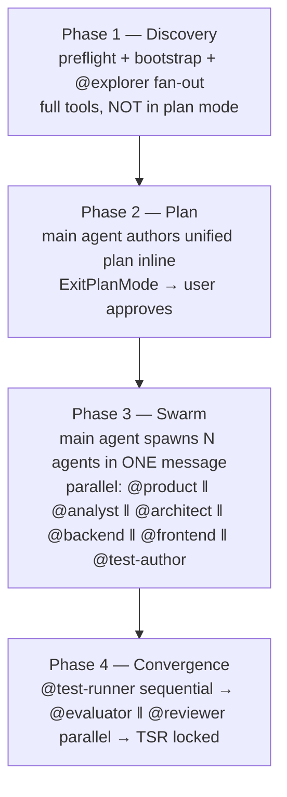

# v5.3 — Unified plan + native PlanMode

Target state for orchestra's pipeline orchestration. Aligns `/orchestra` with Claude Code's native `EnterPlanMode` / `ExitPlanMode` idiom. Single approval gate; parallel swarm execution; session-id-keyed run identity.

## §1 Goals

- **G1** — Single user-facing approval gate. One plan covers the entire pipeline; user reviews once.
- **G2** — Main agent owns orchestration. No subagent acts as orchestrator (forced by Claude Code's PlanMode + Agent tool-frame restrictions).
- **G3** — run-id = Claude Code session-id (zero generation cost; auto-detect; matches session lifecycle).
- **G4** — Brownfield discovery is a dedicated subagent role (`@explorer`), parallelizable per service.
- **G5** — Net surface shrinks. Fewer gates, fewer idioms, fewer state nodes in `commands/orchestra.md`.

## §2 Architecture — 4 phases

Pipeline runs as four sequential phases. Internal parallelism within phase 1 (per-service explorer fan-out), phase 3 (swarm), and phase 4 (eval ‖ review).



### §2.1 Phase 1 — Discovery

Main agent in default tool frame (not plan mode). All tools available.

1. `orchestra-preflight.js` hook fires on `UserPromptSubmit` (`^/orchestra(?::orchestra)?(\s|$)`).
2. Hook emits `<orchestra-preflight>` additional-context block with `session_id` field populated from stdin JSON (`input.session_id`).
3. Main agent reads block, parses `$1`, classifies S1-S9 strategy.
4. Bootstrap loop — `AskUserQuestion` per missing field in declaration order.
5. (Brownfield only) Main agent spawns `@explorer` fan-out in ONE message — one spawn per service.
6. `@explorer` agents return discovery reports written to `.orchestra/plans/<session-id>/discovery/<service>.md`.
7. Main agent reads discovery reports.

### §2.2 Phase 2 — Plan (split: 2a Author + 2b Lock + 2c Revision around a turn boundary)

Phase 2 spans a turn boundary because `ExitPlanMode` does NOT block until approval — the tool submits the plan body, the assistant turn ends, and approval arrives in the next user message. See §5.4 for verified Claude Code semantics. Approve routes 2a→2b→3; reject detours 2a→2c→(loop ≤3)→2b→3; 4th reject halts.

#### §2.2a Phase 2a — Author (Turn 1, ends with ExitPlanMode)

Main agent enters plan mode via explicit `EnterPlanMode` call. Read-only research tools remain available (Read/Grep/Glob/read-only Bash); `Write`/`Edit`/`Task` all blocked while plan mode active.

8. Main agent calls `EnterPlanMode`. Tool returns; plan-mode UI indicator engages.
9. Main agent composes plan body inline in conversation context (cannot `Write` to disk while in plan mode). Reads required inputs: preflight block, `features.yaml` (workspace-persistent), discovery reports (if brownfield), `<service>/local.yaml`. Invokes `skills/task-breakdown` for assignment decomposition.
10. Main agent calls `ExitPlanMode({plan: <run-plan body>})`. Tool submits the plan body to the user via native PlanMode UI; turn ends.

═══ **Turn boundary** — user reviews plan in native PlanMode panel ═══

Approval-signal routing on next user message (trust native UI; clarify only on ambiguity):

- **Clear approve** → §2.2b Lock; next turn restores full tool access.
- **Clear reject (with feedback)** → §2.2c Revision loop; next turn begins still in plan mode.
- **Ambiguous** (mixed approve+reject tokens — e.g. "approved but change X") → main agent fires ONE clarifying `AskUserQuestion` (Approve as-is / Reject with changes); routes from answer.
- **4th cycle still rejected** → main agent Writes `.orchestra/plans/<session-id>/run-plan-DEADLOCK.md` documenting rejection causes; ends turn for user intervention.

#### §2.2b Phase 2b — Lock (Turn 2, default mode restored on approval)

11. Main agent Writes `.orchestra/plans/<session-id>/run-plan.md` with `status: locked`, `run_plan_status: approved`, plus full plan body lifted from the approved ExitPlanMode submission.
12. Main agent emits one `TaskCreate` per `## Agent assignments` row. Each `TaskCreate` carries: `agent` (e.g., `@architect`), `feature_id`, `artifact_path` (the output the assignment row owns), initial `status: pending`. `TaskCreate` calls go in ONE message — they are independent.
13. The `SubagentStop` hook (P2 ledger projector) is NOT triggered by `TaskCreate` directly. The ledger projects task state when each subagent terminates in Phase 3.

#### §2.2c Phase 2c — Revision (reject path, ≤3 cycles)

Fires only on Reject from §2.2a turn-boundary signal routing. Main agent remains in plan mode (no `ExitPlanMode` returns success on reject; tool frame stays read-only-research). Loop body per cycle `N ∈ {1, 2, 3}`:

R1. **Read** reject-comment from the next user message. Classify scope hint: `per-service` (names a service), `per-feature` (names a feature-id), `cross-cutting` (workspace-level), or `unclassified`.

R2. **Self-explore.** Main agent runs targeted `Read` / `Grep` / read-only `Bash` against the hinted scope. NOT a subagent respawn — main agent already holds the original Phase 1 reports in context; cheap targeted reads fill the gap faster than rebuilding via swarm. Examples by scope:
- `per-service` → `Read` the named service's `local.yaml`, `features.yaml`, prior discovery report; `Grep` source surface for the missed concern.
- `per-feature` → `Read` the feature's prior chain artifacts; `Grep` for cross-references.
- `cross-cutting` → `Read` SAD / business-invariants if present; `Glob` for missed services.
- `unclassified` → main agent infers scope from comment prose; if still unable, fires ONE `AskUserQuestion` to disambiguate (counts as part of cycle).

R3. **Append supplemental finding** at `.orchestra/plans/<session-id>/discovery/supplemental-cycle-<N>.md`. Brownfield + greenfield both Write this file; the path documents the new evidence so subsequent cycles + audit trail see it.

R4. **Recompose** plan body inline (still in plan mode). Incorporate new evidence; recompute `## Features` / `## Agent assignments` / `## Risks + decisions` deltas.

R5. **Re-submit** via `ExitPlanMode({plan: <revised body>})`. Turn ends; approval-signal evaluation per §2.2a turn-boundary block repeats.

**Why self-explore (not subagent respawn).** Reject feedback narrows scope (usually one service / one feature / one missed concern). Subagent context isolation does not pay for itself on narrow gaps. Main agent already in context holds prior N reports; targeted `Read` on hinted scope is faster than respawning N-agent swarm. Respawn reserved for blank-slate Phase 1 only.

**Why supplemental-cycle-`<N>`.md (not in-place mutation).** Audit trail. Each revision cycle's new evidence is a distinct artifact reviewable post-run. In-place mutation of the original `discovery/<service>.md` reports loses the "what changed between cycles" signal.

**Cycle == 3 still rejected → DEADLOCK.** Main agent Writes `.orchestra/plans/<session-id>/run-plan-DEADLOCK.md` containing: (a) original plan body; (b) per-cycle reject comment + supplemental evidence; (c) summary of unresolved cause. Ends turn. User takes over (manual triage, plan revision in a fresh session via `claude --fork-session`).

### §2.3 Phase 3 — Swarm (Turn 2, default mode)

Main agent has full tool access (post-approval). Same turn as Phase 2b (Lock).

14. Main agent emits ONE message with N × `Agent({...})` calls — one per swarm participant per feature per the locked plan's `## Agent assignments`. Each spawn prompt carries: `phase: spec-draft` (or `discovery` / `verification` / `gap-resolution` per intent), `feature_id`, `task_id` (assigned at Phase 2b `TaskCreate` emission), owned-path list.
15. Subagents execute in parallel. Each opens with `TaskUpdate(task_id, status: in_progress)`; authors assigned artifact(s); closes with `TaskUpdate(task_id, status: completed)` on success or `status: cancelled` on ESCALATE escape.
16. `SubagentStop` hook fires per subagent termination, projecting the subagent's `TaskCreate` / `TaskUpdate` activity into the session-level ledger at `.orchestra/plans/<session-id>/agent-tasks.md`.
17. Main agent reads `TaskList` to verify Phase 3 completion (all Phase-3 tasks in `completed` status) before advancing to Phase 4.

### §2.4 Phase 4 — Convergence

18. Main agent spawns `@test-runner` (sequential — needs all impl present).
19. `@test-runner` returns. Main agent spawns `@evaluator` ‖ `@reviewer` in ONE message (parallel — independent verdicts).
20. TSR section locks complete. Terminal state.

## §3 Role split

Main thread (your Claude Code session) owns orchestration. Subagents are single-purpose authors.

| Agent | Phase | Tools | Job |
|---|---|---|---|
| `@explorer` (new) | 1 — Discovery | `Read`, `Write`, `Grep`, `Glob`, `Bash` (read-only inspection: `ls`, `find`, `cat`) | Source survey; authors EXPLORER-REPORT to `.orchestra/plans/<session-id>/discovery/<service>.md`. `Write` deliberate (not Claude-Code-Explore-aligned) because main agent enters plan mode for Phase 2 — Plan mode blocks main-agent `Write`, so a Pattern-A "return report inline, main agent persists" flow would force tight ordering. Subagent tool frames are independent of main agent's plan-mode state; authoring from this subagent sidesteps the constraint. Honor-system bounded to the single discovery-report path. |
| `@product` | 3 — Swarm | `Read`, `Write`, `Edit` | Author `<feature-id>-PRD.md` per plan |
| `@analyst` | 3 — Swarm | `Read`, `Write`, `Edit` | Author per-feature `<feature-id>-FRS.md` + per-service `usecase.puml` singleton (PlantUML capability required) per plan |
| `@architect` | 3 — Swarm | `Read`, `Write`, `Edit` (no `Bash`) | Author workspace `SAD.md` / `business-invariants.md` / ADRs / `c4-context.puml` / `c4-container.puml` / workspace `erd-logical.puml` / cross-service `sd-*.puml`; per-service `<service>-BR-AC.md` / `<service>-openapi.yaml` (alt: `asyncapi.yaml` / `clientapi.yaml`) / `c4-component.puml` / `erd-logical.puml` / `state-machine.puml`; per-feature `<feature-id>-TDD.md` + per-feature `sd-<journey>.puml` per plan |
| `@backend` | 3 — Swarm | `Read`, `Write`, `Edit` (no `Bash`) | Server-side impl per plan |
| `@frontend` | 3 — Swarm | `Read`, `Write`, `Edit` (no `Bash`) | UI impl per plan |
| `@test-author` | 3 — Swarm | `Read`, `Write`, `Edit` (no `Bash`, no `src/main/**` read) | Test-plan authoring per plan; `<feature-id>-TSR.md §S-TEST-001` |
| `@test-runner` | 4 — Convergence | `Read`, `Write`, `Edit`, `Bash` | Run test suite, fill `S-TEST-001` evidence |
| `@evaluator` | 4 — Convergence | `Read`, `Write` (strict read-only on src/test); `mcp__orchestra-probe__*` | Score evidence → `<feature-id>-TSR.md §S-EVAL-001` |
| `@reviewer` | 4 — Convergence | `Read`, `Write` | Diff review → `<feature-id>-TSR.md §S-REVIEW-001` |

`@lead` drops from agent set. Plan-authoring inlines into the main agent body. Net agent count 10 → 10 (`@lead` replaced by `@explorer`).

## §4 Storage layout

```
.orchestra/
  system.yaml                          # workspace identity only (no active_run field)
  plans/
    <session-id>/                      # = Claude Code session-id, from preflight hook
      run-plan.md                      # unified PlanMode artifact (status: draft|locked)
      discovery/                       # brownfield only; absent for greenfield
        <service>.md                   # @explorer report per service
      events.jsonl                     # metrics for this run
      agent-tasks.md                   # session-level task ledger (AGENT-TASKS type); single file, hook-projected from subagent transcripts on SubagentStop
    <prior-session-id>/...             # archival across sessions
  <service>/
    local.yaml                         # workspace-persistent service config
    features.yaml                      # intra-service feature DAG manifest
    pipeline/<feature-id>/             # chain-state artifacts; persists across runs
```

Two scopes:

- **Per-session** (`.orchestra/plans/<session-id>/`) — new dir each Claude Code session, regardless of `/orchestra` invocation count within that session. Filesystem state IS the chain state.
- **Workspace-persistent** (`.orchestra/system.yaml`, `.orchestra/<service>/`) — survives across sessions. Carries config + feature DAG + chain artifacts that outlive a planning session.

Multi-`/orchestra`-per-session edge case: same `<session-id>` reuses the dir. Second invocation = S3 partial-resume on existing plan (re-author with feature appended). Hard escape: `claude --fork-session` to force new run-id.

## §5 Constraints from Claude Code

Plugin design assumes the following Claude Code semantics as of release `2.0.42+`. Future-version brittleness flagged.

### §5.1 PlanMode tool restrictions

- `Agent` tool is **blocked while plan mode is active**. Source: anthropics/claude-code GitHub issues #30463, #32731.
- `EnterPlanMode` puts main agent into read-only research state (Read / Grep / Glob / read-only Bash).
- `ExitPlanMode({plan: <body>})` submits plan body to user; tool call blocks until user approves or rejects.
- Approve → `ExitPlanMode` returns success → full tool access restored, including `Agent`.
- Reject → main agent stays in plan mode; user feedback (text) accompanies the rejection; main agent revises.

**Implication.** Plan-then-swarm in one turn IS feasible: research (Read/Grep) → `ExitPlanMode` → user approves → `Agent` spawn cohort. All within one assistant turn.

### §5.2 session-id access

- Slash-command bodies and additional-context tags do **NOT** expose session-id directly.
- Hook event JSON payloads (`UserPromptSubmit`, `PreToolUse`, etc.) **DO** carry `session_id` field on stdin.
- orchestra's existing hooks (`metrics-collector.js`, `agent-plan-sync.js`, `event-shapers.js`) already consume `input.session_id`.

**Implication.** `orchestra-preflight.js` reads `input.session_id`, includes it in the emitted `<orchestra-preflight>` YAML block. Main agent reads the block → session-id available. Zero new infrastructure.

### §5.3 ExitPlanMode is async — plan-then-swarm spans two turns

Web research + GitHub issue review confirmed `ExitPlanMode` does NOT block until user approval:

- The tool submits the plan body and the assistant turn ends. Approval arrives in the NEXT user message.
- Approve → tool-call result returns `success` to the model on the next turn; full tool access restored (including `Task`/`Agent` for swarm dispatch).
- Reject → main agent stays in plan mode; user feedback prefixes the next turn's prompt; main agent revises.
- `Task` (Agent) is genuinely blocked WHILE plan mode is active ([#30463](https://github.com/anthropics/claude-code/issues/30463), [#21292](https://github.com/anthropics/claude-code/issues/21292)).

**Implication.** Plan-then-swarm IS a two-turn flow, not one. Turn 1 ends with `ExitPlanMode`; turn 2 (post-approval) runs `Write run-plan.md` + N × `TaskCreate` + N × `Agent` swarm in ONE message. orchestra's `§2.2a → §2.2b → §2.3` numbering matches this turn boundary.

### §5.4 Known PlanMode bugs + orchestra mitigations

Six open GitHub issues in `anthropics/claude-code` affect PlanMode safety as a production gate. orchestra ships four mitigations; two issues are accepted as design semantics.

| Issue | Symptom | orchestra mitigation |
|---|---|---|
| [#50110](https://github.com/anthropics/claude-code/issues/50110) | `ExitPlanMode` returns `"User has approved"` to the model with no UI interaction; destructive writes may execute pre-approval | **`hooks/scripts/stop-plan-verify.js`** (`Stop` event handler): verifies the post-`ExitPlanMode` turn `Write`s `run-plan.md` before any `Agent` spawn. Silent-approval-triggered swarm halts with `decision: "block"` |
| [#49977](https://github.com/anthropics/claude-code/issues/49977) | Rejected `ExitPlanMode` returns generic rejection string; plan-mode system prompt forces re-invocation; infinite loop | **3-cycle revision cap + DEADLOCK escape** in dispatcher prompt (per §2.2a). On 4th cycle, main agent `Write`s `run-plan-DEADLOCK.md` and ends turn |
| [#50660](https://github.com/anthropics/claude-code/issues/50660) | `PreToolUse permissionDecision:deny` silently ignored on `ExitPlanMode` matcher | **Don't gate `ExitPlanMode` in `PreToolUse`.** Gate post-approval via `Stop` hook (per #50110 mitigation above) |
| [#39713](https://github.com/anthropics/claude-code/issues/39713) | Plan-mode restrictions enforced as `<system-reminder>` only; salience changes in `2.1.83` / `2.1.84` broke enforcement | **Minimum Claude Code version bumped to `2.1.85+`** in README `## Requirements`; CHANGELOG documents the regression range as known unsafe |
| [#59927](https://github.com/anthropics/claude-code/issues/59927) | "Clear context + auto mode" approval option routes through `onReject()` per Anthropic comment on #33870 | **Default-trust native signal; conditional clarify on ambiguity.** §2.2a turn-boundary routing classifies next user message as Clear-approve / Clear-reject / Ambiguous. Mixed-token messages (`"approved but…"` / `"looks good, change X"`) trigger ONE clarifying `AskUserQuestion` (Approve / Reject) instead of inferring from prose; cycle ≤3 still bounds retries |
| [#60329](https://github.com/anthropics/claude-code/issues/60329) | `ExitPlanMode` conflates "exit plan mode" with "approve and execute"; no defer/abandon option | **Accepted as design semantic.** orchestra's approval gate IS "execute the plan"; defer = user closes the session and restarts |

Additional constraint surfaced during research: **subagents cannot spawn sub-subagents.** `Agent` / `EnterPlanMode` / `ExitPlanMode` / `AskUserQuestion` are stripped from subagent tool registry at spawn time ([#32731](https://github.com/anthropics/claude-code/issues/32731), [#19077](https://github.com/anthropics/claude-code/issues/19077), [#46424](https://github.com/anthropics/claude-code/issues/46424)). The v5.3 swap from a `@lead`-orchestrator to main-agent orchestration sidesteps this constraint as a side-effect — `@lead` could not have spawned `@backend` / `@frontend` / `@test-author` in the original design.

Subagent within-agent parallelism (e.g., `@architect` fanning out across N services) uses nested `Agent({...})` calls ONLY when the spawning agent IS the main agent. Same-named subagent recursive spawn (`@architect → @architect`) inside Phase 3 is permitted only via main-agent re-entry — main agent spawns N × `@architect` in ONE message, not `@architect` spawning sibling `@architect`.

## §6 Unified plan body shape

The plan body (`.orchestra/plans/<session-id>/run-plan.md`) carries three load-bearing sections. Frontmatter and shape canonicalized in `schemas/run-plan.schema.md`.

### §6.1 `## Features`

DAG of features to author. Per-feature entry:

- `<feature-id>` — `<short-service-name>-<NNN>-<slug>`.
- `classifier` — `business` | `tech` (output of intent classification; informs which artifact slots to populate).
- `depends_on` — list of feature-ids that must reach `verdict: PASS` before this feature spawns.
- `supersedes` — list of feature-ids being replaced (predecessor `status:` user-controlled).
- `artifact_slots` — for business features: per-feature `PRD`, `FRS`, `TDD` plus per-service single-writer touches (`<service>-openapi.yaml` / `asyncapi.yaml` / `clientapi.yaml`, `diagrams/c4-component.puml`, `diagrams/erd-logical.puml`, `diagrams/state-machine.puml`, `diagrams/usecase.puml` — only the singletons the feature actually mutates). Per-feature diagram surface is `sd-<journey>.puml`-only. For tech features: implementation target only.

### §6.2 `## Agent assignments`

Per-artifact mapping of output path to authoring subagent. The plan author (main agent) lifts the relevant subset of the canonical matrix per scope + chain direction + feature classifier.

#### §6.2.1 Canonical artifact ownership matrix

Comprehensive map of every artifact orchestra produces, the agent that authors it, the phase it fires, and the scope condition that gates its presence in a given plan.

| Artifact path | Author | Phase | Scope gate |
|---|---|---|---|
| `.orchestra/plans/<session-id>/discovery/<service>.md` | `@explorer` | 1 | `mode: brownfield` only; one per service in plan scope |
| `docs/SAD.md` | `@architect` | 3 | `workspace_kind: multi-repo` AND `scope_level: system-wide` |
| `docs/business-invariants.md` | `@architect` | 3 | `workspace_kind: multi-repo` AND `scope_level: system-wide` |
| `docs/adr/ADR-<NNNN>-<slug>.md` | `@architect` | 3 | `workspace_kind: multi-repo`; zero or more (only when ADR-worthy decision surfaces) |
| `docs/diagrams/c4-context.puml` | `@architect` | 3 | `workspace_kind: multi-repo` |
| `docs/diagrams/c4-container.puml` | `@architect` | 3 | `workspace_kind: multi-repo` |
| `docs/diagrams/erd-logical.puml` | `@architect` | 3 | `workspace_kind: multi-repo` |
| `docs/diagrams/sd-<full-cross-service-journey>.puml` | `@architect` | 3 | `workspace_kind: multi-repo`; one per Journey-gate outcome category |
| `docs/<service>/<service>-BR-AC.md` | `@architect` | 3 | per-service singleton (every scope except greenfield single-feature) |
| `docs/<service>/<service>-openapi.yaml` | `@architect` | 3 | per-service singleton; HTTP-producer service; single-writer (concurrent features serialize) |
| `docs/<service>/<service>-asyncapi.yaml` | `@architect` | 3 | per-service singleton; event-driven service (alternative to openapi); single-writer |
| `docs/<service>/<service>-clientapi.yaml` | `@architect` | 3 | per-service singleton; HTTP-consumer service; single-writer |
| `docs/<service>/adr/ADR-<service>-<NNN>-<slug>.md` | `@architect` | 3 | per-service; zero or more |
| `docs/<service>/diagrams/c4-component.puml` | `@architect` | 3 | per-service singleton (L3); single-writer |
| `docs/<service>/diagrams/erd-logical.puml` | `@architect` | 3 | per-service singleton; single-writer |
| `docs/<service>/diagrams/state-machine.puml` | `@architect` | 3 | per-service singleton; merges business + technical state across all lifecycle features of the service; single-writer |
| `docs/<service>/diagrams/usecase.puml` | `@analyst` | 3 | per-service singleton; end-user persona use cases across all features of the service; single-writer |
| `docs/<service>/<feature-id>/<feature-id>-PRD.md` | `@product` | 3 | per-feature; `classifier: business` only |
| `docs/<service>/<feature-id>/<feature-id>-FRS.md` | `@analyst` | 3 | per-feature; `classifier: business` only |
| `docs/<service>/<feature-id>/<feature-id>-TDD.md` | `@architect` | 3 | per-feature; `classifier: business` only |
| `docs/<service>/<feature-id>/diagrams/<feature-id>-sd-<journey>.puml` | `@architect` | 3 | per-feature; one per Journey-gate outcome category (`sd` = sequence diagram); only per-feature diagram surface |
| `services/<service>/src/main/<lang>/**` | `@backend` | 3 | per-feature; forward chain only |
| `services/<service>/src/test/<lang>/**` (unit tests) | `@backend` | 3 | per-feature; forward chain only |
| `web/src/**` (or framework-equivalent UI tree) | `@frontend` | 3 | per-feature; forward chain + UI projects only |
| `docs/<service>/<feature-id>/<feature-id>-TSR.md §S-TEST-001` (plan rows) | `@test-author` | 3 | per-feature; forward chain only |
| `docs/<service>/<feature-id>/<feature-id>-TSR.md §S-TEST-001` (status + evidence cells) | `@test-runner` | 4 | per-feature; forward chain only |
| `services/<service>/src/test/<lang>/**` (white-box / edge cases) | `@test-runner` | 4 | per-feature; forward chain only |
| `docs/<service>/<feature-id>/<feature-id>-TSR.md §S-EVAL-001` | `@evaluator` | 4 | per-feature; forward chain only |
| `docs/<service>/<feature-id>/<feature-id>-TSR.md §S-REVIEW-001` | `@reviewer` | 4 | per-feature; forward chain only |
| `.orchestra/<service>/features.yaml` (entry) | `@product` | 3 (greenfield) / 3-last (brownfield) | per-feature; `@product` writes the entry as part of PRD authoring (greenfield) or as the final reverse-pass step (brownfield) |

**Notes on the matrix:**

- "Phase" = the 4-phase model from `§2`. Phase 3 = swarm; phase 4 = convergence.
- "Author" = the agent that performs the `Write`. `@architect` carries the broadest mandate because architecture spans workspace + service + feature scope.
- `@lead` is absent. Plan-authoring (formerly its job) is inlined into the main agent.
- `.orchestra/<service>/local.yaml`, `.orchestra/<service>/features.yaml`, `.orchestra/system.yaml` are MCP-tool-mutated (`mcp__orchestra-utils__*`), not direct `Write`. Author column reflects who calls the MCP tool.
- `.orchestra/plans/<session-id>/run-plan.md` is authored by the **main agent** (not a subagent). Listed for completeness elsewhere; excluded from this matrix because the matrix covers subagent assignments only.

#### §6.2.2 Plan-body instantiation — forward chain (greenfield, multi-repo, system-wide)

Real example for a hypothetical plan covering one new feature (`order-001-checkout`) in a multi-repo workspace where workspace SAD does not yet exist:

```yaml
# Workspace-scope (multi-repo + system-wide only)
workspace:
  - path: docs/SAD.md
    author: "@architect"
  - path: docs/business-invariants.md
    author: "@architect"
  - path: docs/diagrams/c4-context.puml
    author: "@architect"
  - path: docs/diagrams/c4-container.puml
    author: "@architect"
  - path: docs/diagrams/erd-logical.puml
    author: "@architect"
  # ADRs added by @architect as decisions surface; not enumerated upfront
  # docs/diagrams/sd-<full-cross-service-journey>.puml authored when cross-service journey surfaces

# Per-service singletons (initial create on first service occurrence in plan)
services:
  - service: order
    artifacts:
      - path: docs/order/order-BR-AC.md
        author: "@architect"
      - path: docs/order/order-openapi.yaml
        author: "@architect"
      - path: docs/order/diagrams/c4-component.puml
        author: "@architect"
      - path: docs/order/diagrams/erd-logical.puml
        author: "@architect"
      - path: docs/order/diagrams/state-machine.puml
        author: "@architect"
      - path: docs/order/diagrams/usecase.puml
        author: "@analyst"

# Per-feature
features:
  - feature: order-001-checkout
    direction: forward
    classifier: business
    depends_on: []
    supersedes: []

    # Phase 3 — Swarm: per-feature spec
    spec_artifacts:
      - path: docs/order/order-001-checkout/order-001-checkout-PRD.md
        author: "@product"
      - path: docs/order/order-001-checkout/order-001-checkout-FRS.md
        author: "@analyst"
      - path: docs/order/order-001-checkout/order-001-checkout-TDD.md
        author: "@architect"

    # Phase 3 — Swarm: per-feature diagrams (sd-only; c4-component / usecase / state-machine / erd
    # are per-service singletons and live under service_singletons_touched below)
    diagram_artifacts:
      - path: docs/order/order-001-checkout/diagrams/order-001-checkout-sd-forward-purchase.puml
        author: "@architect"

    # Phase 3 — Swarm: per-feature contributions to per-service single-writer artifacts.
    # Concurrent features touching same singleton serialize at the authoring agent's spawn level.
    service_singletons_touched:
      - path: docs/order/order-openapi.yaml
        author: "@architect"
        write_mode: append-endpoints
      - path: docs/order/diagrams/c4-component.puml
        author: "@architect"
        write_mode: append-components                    # new components / dependencies introduced by feature
      - path: docs/order/diagrams/erd-logical.puml
        author: "@architect"
        write_mode: append-entities                      # persistence-touching features only
      - path: docs/order/diagrams/state-machine.puml
        author: "@architect"
        write_mode: append-states                        # lifecycle-touching features only
      - path: docs/order/diagrams/usecase.puml
        author: "@analyst"
        write_mode: append-usecases                      # end-user-visible features only

    # Phase 3 — Swarm: implementation + test plan
    impl_artifacts:
      - path: services/order/src/main/java/**
        author: "@backend"
      - path: services/order/src/test/java/** (unit)
        author: "@backend"
      - path: web/src/components/Checkout/** (UI states: loading | empty | error | success)
        author: "@frontend"
      - path: docs/order/order-001-checkout/order-001-checkout-TSR.md (§S-TEST-001 plan)
        author: "@test-author"

    # Phase 4 — Convergence
    convergence_artifacts:
      - path: docs/order/order-001-checkout/order-001-checkout-TSR.md (§S-TEST-001 evidence)
        author: "@test-runner"
      - path: services/order/src/test/java/** (white-box + edge cases)
        author: "@test-runner"
      - path: docs/order/order-001-checkout/order-001-checkout-TSR.md (§S-EVAL-001)
        author: "@evaluator"
      - path: docs/order/order-001-checkout/order-001-checkout-TSR.md (§S-REVIEW-001)
        author: "@reviewer"

    # Manifest mutation
    manifest:
      - path: .orchestra/order/features.yaml (entry for order-001-checkout)
        author: "@product"
        tool: mcp__orchestra-utils__upsert_features_yaml
```

#### §6.2.3 Plan-body instantiation — reverse chain (brownfield, multi-repo, system-wide)

Same workspace; reverse-pass against an existing source tree. Direction flips (src → spec); fan-out + convergence sections absent.

```yaml
# Phase 1 — Discovery (brownfield only)
discovery:
  - service: order
    report_path: .orchestra/plans/<session-id>/discovery/order.md
    author: "@explorer"
  - service: payment
    report_path: .orchestra/plans/<session-id>/discovery/payment.md
    author: "@explorer"

# Phase 3 — Swarm (workspace + services + features)
workspace:
  - path: docs/SAD.md
    author: "@architect"
    reverse_authoring_mode: re-author    # no prior docs/README.md provenance marker
  - path: docs/business-invariants.md
    author: "@architect"
    reverse_authoring_mode: re-author
  - path: docs/diagrams/c4-context.puml
    author: "@architect"
  - path: docs/diagrams/c4-container.puml
    author: "@architect"
  - path: docs/diagrams/erd-logical.puml
    author: "@architect"

services:
  - service: order
    artifacts:
      - path: docs/order/order-BR-AC.md
        author: "@architect"
        reverse_authoring_mode: re-author
      - path: docs/order/order-openapi.yaml
        author: "@architect"
        reverse_authoring_mode: re-author
      - path: docs/order/diagrams/c4-component.puml
        author: "@architect"
      - path: docs/order/diagrams/erd-logical.puml
        author: "@architect"
      - path: docs/order/diagrams/state-machine.puml
        author: "@architect"
      - path: docs/order/diagrams/usecase.puml
        author: "@analyst"

features:
  - feature: order-001-checkout
    direction: reverse
    classifier: business
    depends_on: []

    # Phase 3 — Swarm: source-derived spec.
    # Within a feature, authors run sequentially:
    #   @architect (derives TDD from src; appends to per-service openapi/c4-component/erd/state-machine) →
    #   @analyst   (derives FRS; appends to per-service usecase) →
    #   @product   (synthesizes PRD; writes features.yaml entry)
    spec_artifacts:
      - path: docs/order/order-001-checkout/order-001-checkout-TDD.md
        author: "@architect"
        reverse_authoring_mode: re-author
      - path: docs/order/order-001-checkout/order-001-checkout-FRS.md
        author: "@analyst"
        reverse_authoring_mode: re-author
      - path: docs/order/order-001-checkout/order-001-checkout-PRD.md
        author: "@product"
        reverse_authoring_mode: re-author

    # Phase 3 — Swarm: per-feature diagrams (sd-only; remaining diagram surfaces are per-service singletons)
    diagram_artifacts:
      - path: docs/order/order-001-checkout/diagrams/order-001-checkout-sd-forward-purchase.puml
        author: "@architect"

    # Phase 3 — Swarm: per-feature contributions to per-service single-writer artifacts.
    # Reverse-pass appends derive from source archaeology; same single-writer serialization rule applies.
    service_singletons_touched:
      - path: docs/order/order-openapi.yaml
        author: "@architect"
        write_mode: append-endpoints
        reverse_authoring_mode: re-author
      - path: docs/order/diagrams/c4-component.puml
        author: "@architect"
        write_mode: append-components
      - path: docs/order/diagrams/erd-logical.puml
        author: "@architect"
        write_mode: append-entities                      # persistence-touching features only
      - path: docs/order/diagrams/state-machine.puml
        author: "@architect"
        write_mode: append-states                        # lifecycle-touching features only
      - path: docs/order/diagrams/usecase.puml
        author: "@analyst"
        write_mode: append-usecases                      # end-user-visible features only

    # Phase 3 reverse-pass: no impl_artifacts (reverse never touches src/**)
    # Phase 4: no convergence (reverse-pass authors no TSR)

    # Manifest mutation (final reverse-pass step)
    manifest:
      - path: .orchestra/order/features.yaml (entry for order-001-checkout)
        author: "@product"
        tool: mcp__orchestra-utils__upsert_features_yaml
```

#### §6.2.4 Plan-body conventions

- Author lines REFERENCE the agent by handle (`"@product"`); never inline agent prompts. Spawn briefs derive from agent files.
- `reverse_authoring_mode` field appears only on **narrative** reverse-direction entries (`.md` artifacts: SAD, business-invariants, BR-AC, PRD, FRS, TDD) and on `.yaml` contract artifacts (openapi/asyncapi/clientapi). Three-valued enum (`re-author` | `copy-and-modify` | `cite-as-is`) per `schemas/pipeline-artifact.schema.md`. Diagrams (`.puml`) OMIT the field — reverse-pass always re-derives the diagram from source archaeology; the three-mode distinction does not apply.
- `tool:` line on manifest entries names the MCP tool that performs the write (closed-allowlist).
- Plan describes WHO does WHAT, not HOW. Domain decisions stay with the authoring agent.
- Plan-author (main agent) omits sections that don't apply: `workspace:` absent on per-service scope; `discovery:` absent on greenfield; `impl_artifacts:` + `convergence_artifacts:` absent on reverse direction.

**Single-writer surfaces.** Six per-service artifacts are single-writer — at most one `@architect` or `@analyst` may hold a write on the file at any moment:

- `docs/<service>/<service>-openapi.yaml` (alt: `asyncapi.yaml` / `clientapi.yaml`)
- `docs/<service>/diagrams/c4-component.puml`
- `docs/<service>/diagrams/erd-logical.puml`
- `docs/<service>/diagrams/state-machine.puml`
- `docs/<service>/diagrams/usecase.puml`
- `docs/<service>/<service>-BR-AC.md`

Concurrent features touching the same per-service singleton serialize at the authoring agent's spawn level. Main agent enforces by NOT batching parallel `Agent` spawns when their `service_singletons_touched` paths intersect. Single-writer ALSO applies to workspace-scope singletons (`docs/SAD.md`, `docs/business-invariants.md`, `docs/diagrams/c4-context.puml`, `docs/diagrams/c4-container.puml`, `docs/diagrams/erd-logical.puml`).

**Per-feature `service_singletons_touched` semantics.**

- `write_mode: append-endpoints` / `append-entities` / `append-components` / `append-states` / `append-usecases` — feature contributes a delta to an existing per-service singleton; @architect/@analyst reads current artifact, computes delta, merges, writes whole file.
- Reverse-pass mode: same surfaces, but content derives from source archaeology rather than spec authoring. `reverse_authoring_mode: re-author` on the singleton row marks "first reverse-pass touches this service".
- Features that DO NOT mutate a given singleton omit the row entirely (e.g., a no-persistence feature omits `erd-logical.puml`; a no-lifecycle feature omits `state-machine.puml`; a non-end-user-visible feature omits `usecase.puml`).

### §6.3 `## Risks + decisions`

Up-front surfacing of:

- ADR-worthy decisions to author during the run.
- Constraints from preflight (autonomy level, spawn mode, language stack).
- Maximum revision cycles per gate (default 3).
- Auto-mode behavior on plan approval (`auto_mode: true` → between-phase gates skip; structural-failure halts preserved).
- Known unknowns to research mid-execution.

## §7 Brownfield divergence

Reverse-pass aligns to the same 4-phase model. Phase 3 swarm direction reverses: src → spec.

### §7.1 Phase 1 — Discovery (brownfield)

`@explorer` fan-out is the heavy first step. Per service:

- Read `src/main/**` and build manifests (Maven `pom.xml`, Gradle, `package.json`, etc.).
- Detect features by source surface: REST controllers, message handlers, scheduled jobs, CLI entry-points.
- Estimate per-feature complexity (LOC, dependencies, persistence touched, external integrations).
- Surface ADR-worthy decisions found in source archaeology.
- Return structured markdown report at `.orchestra/plans/<session-id>/discovery/<service>.md`.

### §7.2 Phase 2 — Plan (brownfield)

Main agent reads discovery reports + workspace state. Plan body's `## Features` section enumerates discovered features. `## Agent assignments` swarms `@architect` first per feature (per-feature TDD authoring + appends to per-service single-writer surfaces: `<service>-openapi.yaml`, `c4-component.puml`, `erd-logical.puml`, `state-machine.puml`), then `@analyst` (per-feature FRS + append to per-service `usecase.puml`), then `@product` (per-feature PRD + `features.yaml` entry).

### §7.3 Phase 3 — Swarm (brownfield)

Reverse-pass swarm fans out per feature. Within a feature, authors run sequentially: `@architect` → `@analyst` → `@product` (each handoff is a dependency in plan-mode terms; main agent serializes).

Inter-feature parallelism preserved: features at the same DAG rank spawn in parallel cohorts.

### §7.4 Phase 4 — Convergence (brownfield)

Reverse-pass produces no source impl; no `@test-runner` / `@evaluator` / `@reviewer` in reverse mode. Phase 4 trivially completes when last `@product` returns. Forward-chain `spec-to-code` follow-up against the locked reverse-derived baseline carries the full convergence.

## §8 Refactor phasing

| Phase | Scope | Effort | Risk |
|---|---|---|---|
| **P0** — Brief (this document) | Single new file in `docs/` | Small | Low |
| **P1** — Schemas | Expand `schemas/run-plan.schema.md` for unified plan body. Update `schemas/pipeline-artifact.schema.md` for `@explorer` artifact type. | Small | Low |
| **P2** — Hooks | `hooks/scripts/orchestra-preflight.js` adds `session_id` to block emission. `hooks/scripts/agent-plan-sync.js` simplifies (one plan per session, not per agent per feature). | Small | Medium |
| **P3** — Agents | Drop `agents/lead.md`. Add `agents/explorer.md`. Update every other agent to drop per-gate `Feedback:` re-spawn discipline; add "execute against locked plan" mode. | Large | High |
| **P4** — Dispatcher | `commands/orchestra.md` major rewrite: collapse gates, swap idioms, drop `chain:` branching, document Phase 1-4 + plan-mode contract. | Large | Medium |
| **P5** — Strategy refs | All 9 `skills/orchestra-strategies/references/S*.md` align to 4-phase model. | Medium | Low |
| **P6** — Tests | Update `scripts/tests/hooks.test.js` token fixture. Add `scripts/tests/unified-plan.test.js` asserting the 4-phase flow + session-id-in-preflight. | Medium | Medium |
| **P7** — README + memory | New `## Folder layout` section in `README.md`. Retire memory notes `run-plan-gate-mode-split`, `high-confidence-still-confirms` (forward-chain scope only). | Small | Low |

**Total effort:** ~25-30 files touched. Net line count delta NEGATIVE (surface shrinks).

## §9 Risk register

### §9.1 PlanMode behavior changes upstream

**Risk.** Claude Code may alter `EnterPlanMode` / `ExitPlanMode` tool semantics in a future release (e.g., split into separate "submit" and "approve" tool calls, or change approval signaling).

**Mitigation.**
- `scripts/tests/unified-plan.test.js` asserts the flow end-to-end with mocked tool responses.
- Brief `§5` documents the assumed semantics + Claude Code version pin (`2.0.42+`).
- README `## Requirements` already pins `Claude Code ≥ 2.0.42`; bump on incompatibility.

### §9.2 Plan body bloat

**Risk.** Multi-repo with N services × M features may produce unwieldy plan body. PlanMode panel rendering degrades.

**Mitigation.**
- Plan body is skeleton-shape (artifact slots + agent assignments + DAG), not artifact content. Caps size at ~200-400 lines even for 10-feature workspaces.
- Brief `§6` documents the section shape; `schemas/run-plan.schema.md` enforces.

### §9.3 Main agent context bloat in Phase 1

**Risk.** `@explorer` fan-out returns N reports concatenated into main agent context. Multi-repo with many services pushes context limits.

**Mitigation.**
- `@explorer` reports are summary-shape (per-service ~50-100 lines, not raw source).
- Worst case (10-service workspace, 100 lines each) = 1000 lines added context. Manageable.
- If context limit hit: main agent compacts via summary read before plan authoring.

### §9.4 Mid-swarm divergence

**Risk.** `@architect` writes TDD; mid-authoring discovers PRD is wrong. No mid-chain gate to catch.

**Mitigation.**
- Ratify-spec path (already shipped): `mcp__orchestra-utils__amend_locked_artifact` + `relock_artifact`. Same mechanism that handles verification-phase divergence today.
- `@evaluator` flags at Phase 4 convergence; reviewer amends; full audit trail via `## Changelog` block.

### §9.5 @lead drop affects metrics joins

**Risk.** `events.jsonl` rows with `agent: "@lead"` accumulate from prior runs. New schema has no `@lead`. Replay-style tooling may fail.

**Mitigation.**
- v5.3 is blank-install discipline (per project rule). Existing installs upgrade by deleting `.orchestra/` and re-running. No migration shim.
- `scripts/tests/metrics.test.js` updated to assert new agent set.

### §9.6 No published plan-then-swarm precedent

**Risk.** orchestra is the first plugin to combine native PlanMode with parallel subagent swarm. Edge cases may surface only in production.

**Mitigation.**
- Phase P6 test coverage emphasizes the plan-mode + `Agent`-spawn turn handoff specifically.
- Brief §5.3 documents the verified two-turn flow.
- Smoke loop (post-release, user-driven) catches integration issues.

### §9.7 PlanMode bug surface area

**Risk.** Six known open issues in `anthropics/claude-code` affect PlanMode as a production gate: silent approval (#50110), rejection loop (#49977), hook bypass (#50660), enforcement regression (#39713), approval-as-reject routing (#59927), exit-conflated-with-approve (#60329).

**Mitigation.** Per §5.4 — four orchestra-side mitigations (the `stop-plan-verify` `Stop` hook, the 3-cycle DEADLOCK cap in dispatcher, post-approval `Stop`-hook gating instead of `PreToolUse`, minimum-version pin in README) plus one conditional-clarify (#59927 mixed-token route) plus one accepted-as-design semantic (#60329 exit-IS-approve).

### §9.8 Self-explore context growth across revision cycles

**Risk.** §2.2c reject loop has main agent self-explore (NOT subagent respawn) on each cycle. Three cycles × targeted Read/Grep + supplemental-cycle-`<N>`.md appends grow main-agent context. Worst case: 3 cycles × ~200 lines supplemental finding each = 600 lines on top of Phase 1 explorer reports.

**Mitigation.**
- §2.2c R2 specifies *targeted* Read/Grep on scope hint — bounded reads, not blanket re-survey.
- Supplemental finding format is summary-shape (delta against original report), not raw source dump.
- 3-cycle hard cap bounds growth; 4th cycle DEADLOCKs to fresh-session restart.
- Alternative considered + rejected: respawning explorer swarm on each reject. Loses original Phase 1 evidence from main-agent context; net context cost similar; subagent isolation does not pay for itself on narrow reject feedback.

## §10 Memory notes affected

| Note | Action |
|---|---|
| `run-plan-gate-mode-split` | Retire. Unified-plan model uses PlanMode for the single approval gate; no `chain:` branching. |
| `high-confidence-still-confirms` | Narrow scope. Confirmation gate still applies in Phase 1 (intent restate); does NOT apply per gate in Phase 3 swarm (no per-gate review). |
| `parallel-spawn-discipline` | Reinforce. Phase 3 swarm IS the canonical N-spawn-in-ONE-message use case. |
| `terse-proposals-not-multi-option` | Reinforce. PlanMode submission IS the one proposal; multi-option `AskUserQuestion` reserved for bootstrap fields. |
| `dev-vs-consumer-command-placement` | No change. |

## §11 Open questions

- **Q1** — `@explorer` complexity estimation algorithm. Brief `§7.1` says "estimate complexity" but doesn't fix the rubric. Candidates: pure LOC, dependency-graph fanout, persistence-touched flag, integration-touched flag. → Resolve in P3 when authoring `agents/explorer.md`.
- **Q2** — Multi-`/orchestra`-per-session merge semantics. Brief `§4` proposes "re-author plan with feature appended"; the algorithm for append-without-conflict needs spec. → Resolve in P1 when expanding `schemas/run-plan.schema.md`.
- **Q3** — Reverse-pass `@product` ordering. Currently brief `§7.3` says `@architect → @analyst → @product` per feature. Should `@product` writing `features.yaml` entry race with phase 3 swarm completion? Order constraint to lock down in P3.

## §12 Out of scope for v5.3

- Replacing `AskUserQuestion` with `EnterPlanMode` for PRD / FRS / TDD reviews. Domain docs ≠ plans; chip UX is the right idiom for those gates (when they fire — typically only during ratify-spec).
- Cross-service feature DAG (currently intra-service only per `features.yaml` shape).
- Distributed swarm across multiple Claude Code sessions. orchestra remains single-session.

## §13 References

- `commands/orchestra.md` — consumer-surface dispatcher contract (target of P4 rewrite).
- `agents/lead.md` — drops in P3.
- `agents/explorer.md` — new in P3.
- `schemas/run-plan.schema.md` — target of P1 expansion.
- `hooks/scripts/orchestra-preflight.js` — target of P2 `session_id` field addition.
- `README.md` — target of P7 `## Folder layout` addition.
- `docs/audit-2026-05-21.md` — running audit log; append v5.3 row when P0 commits.
