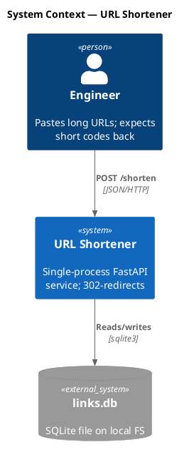
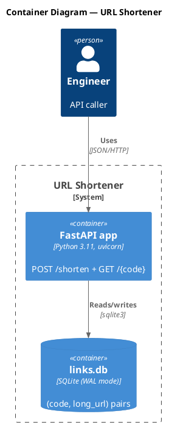
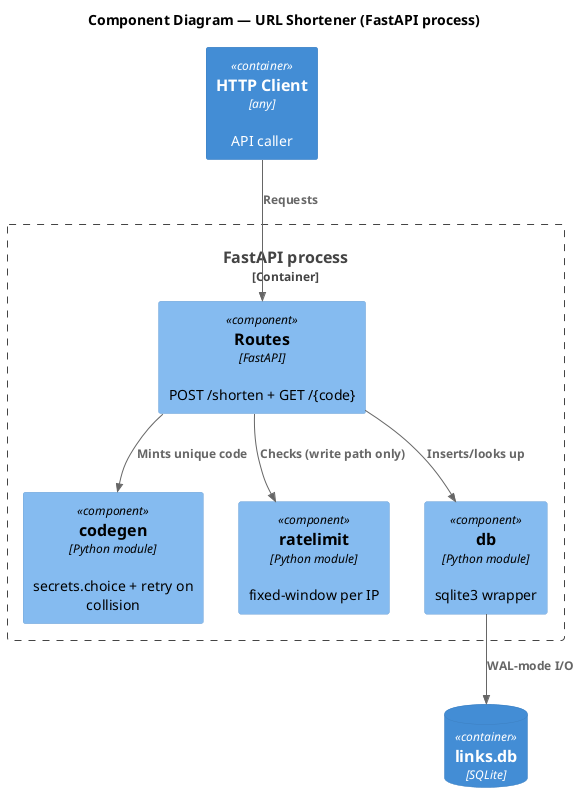
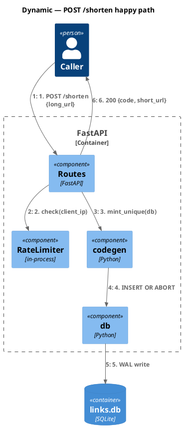
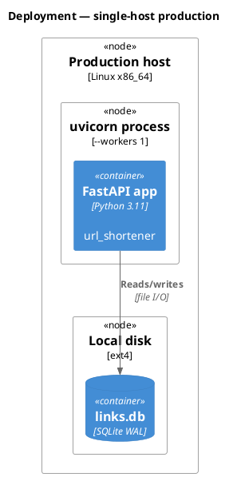

# c4-architecture

Generates C4-model diagrams (Context / Container / Component / Deployment / Dynamic) in PlantUML via the C4-PlantUML stdlib. `@lead` invokes when authoring SAD or TDD diagrams.

## When to use

- `@lead` authoring `architecture/SAD.md` — needs Context (L1) + Container (L2).
- `@lead` authoring `pipeline/<NNN>-<slug>/design/<NNN>-TDD.md` — needs Component (L3) and/or Dynamic flow diagrams.
- `@lead` authoring `pipeline/<NNN>-<slug>/interfaces/<NNN>-CONTRACT.md` — needs sequence diagrams for critical-path criteria.

## Approach

### Step 1 — Pick C4 level by audience

| Level | Diagram | Audience | Shows | When to create |
|---|---|---|---|---|
| 1 | **C4_Context** | Everyone | System + external actors | Always (required for SAD) |
| 2 | **C4_Container** | Technical | Apps, databases, services | Always (required for SAD) |
| 3 | **C4_Component** | Developers | Internal components | Required for TDD |
| 4 | **C4_Deployment** | DevOps | Infrastructure nodes | Production systems |
| — | **C4_Dynamic** | Technical | Numbered request flows | Complex workflows; required for TDD critical-path sequences |

Context + Container suffice for most teams. Generate Component / Deployment only when they answer a specific question.

### Step 2 — Apply MUST / MUST-NOT (binding)

Every C4 `.puml` MUST:

- Start with `!include <C4/C4_Context|C4_Container|C4_Component|C4_Dynamic|C4_Deployment>` after `@startuml`, plus a `title` line.
- Use stdlib macros: `Person` / `System` / `Container` / `Component` (plus `*_Ext` / `*Db` / `*Queue` / `*_Boundary` variants) for elements; `Rel(...)` for relationships.

Every C4 `.puml` MUST NOT:

- Use raw PlantUML primitives (`rectangle` / `actor` / `component` / `package` / `node` / `database`) for body elements — they have no C4 type semantics.
- Use raw arrow syntax (`-->` / `->` / `..>`) or generic verbs ("Uses" / "Calls"). `Rel(...)` enforces unidirectional + labeled.
- Use `skinparam` for body styling. Use `UpdateElementStyle()` / `UpdateRelStyle()` instead, or accept stdlib defaults.

### Step 3 — Author from quick-start templates

Five quick-start fenced templates below: Context, Container, Component, Dynamic, Deployment. Use as starting points; element-syntax + styling-macro tables follow.

### Step 4 — Apply mandatory rules

Five essentials (extended discussion in `references/c4-rules.md`):

1. **Every element** has name, type-by-macro, technology (where applicable), description.
2. **Unidirectional arrows only** — `Rel(from, to, ...)`. No `BiRel` unless genuinely peer-to-peer.
3. **Action verbs** on labels — "Sends payment intent via" not "Uses".
4. **Technology labels** — "JSON/HTTPS", "JDBC", "gRPC".
5. **≤20 elements per diagram** — split when dense.

Component diagrams answer ONE specific question (e.g., "How does retry vs fail-fast work inside the Payment API?"). For trivial single-component containers, omit and write `<!-- OMIT: trivial container; single component -->` in TDD `S-COMPONENTS-001` with `component_count: 0`.

For framework internals (Tomcat, DispatcherServlet, Jackson, ORM `SessionFactory`, `RestTemplate` / `WebClient` as standalone boxes) — these are NOT components. See `references/c4-rules.md`. If you need to show that flow, draw it with `C4_Dynamic` and numbered `Rel`s.

For microservices ownership patterns (single-team / multi-team / event-driven), see `references/c4-rules.md`.

### Step 5 — Render via /plantuml

```bash
python ${CLAUDE_PLUGIN_ROOT}/skills/plantuml/scripts/convert_puml.py <path>.puml --format svg
```

The hash-stamper hook tracks both `.puml` source hash and rendered `.svg` hash in the artifact's paired `<artifact>.lock.yaml` `diagrams[]` block.

### Step 6 — Self-check before declaring done

Walk this checklist; any "no" → fix the source, do not render:

- [ ] **Title** present (e.g., `title C4 Level 2 — Containers — hello-world`).
- [ ] **Stdlib `!include`** used; no raw `rectangle` / `actor` / `component` / `package` / `node` / `database` in body.
- [ ] **Every element**: name (1st arg), type-by-macro (`Person` / `System` / `Container` / `Component`, not just hinted in label), description (last arg), technology (3rd arg for Container / Component).
- [ ] **L1 Context**: no transport protocols on relationships. **L3 Component**: no framework internals (see `references/c4-rules.md`).
- [ ] **Every `Rel(...)`**: label, technology arg at Container / Component level, action verb (no "Uses" / "Calls" / "Talks to"), unidirectional (no `BiRel` unless genuinely peer-to-peer).
- [ ] **Stand-alone test**: handed the rendered `.svg` to a stranger — can they tell what the system does, who uses it, how it's built, without your narration?

## Quick-start templates

### System Context (Level 1)



### Container Diagram (Level 2)



### Component Diagram (Level 3)



### Dynamic Diagram (request flow)



### Deployment Diagram



## Element syntax — C4-PlantUML stdlib macros

### People and systems

```
Person(alias, "Label", "Description")
Person_Ext(alias, "Label", "Description")          ' External person
System(alias, "Label", "Description")
System_Ext(alias, "Label", "Description")          ' External system
SystemDb(alias, "Label", "Description")            ' Database system
SystemQueue(alias, "Label", "Description")         ' Queue system
SystemDb_Ext(alias, "Label", "Description")        ' External DB
```

### Containers

```
Container(alias, "Label", "Technology", "Description")
Container_Ext(alias, "Label", "Technology", "Description")
ContainerDb(alias, "Label", "Technology", "Description")
ContainerQueue(alias, "Label", "Technology", "Description")
```

### Components

```
Component(alias, "Label", "Technology", "Description")
Component_Ext(alias, "Label", "Technology", "Description")
ComponentDb(alias, "Label", "Technology", "Description")
```

### Boundaries

```
Enterprise_Boundary(alias, "Label") { ... }
System_Boundary(alias, "Label") { ... }
Container_Boundary(alias, "Label") { ... }
Boundary(alias, "Label", "type") { ... }
```

### Relationships

```
Rel(from, to, "Label")
Rel(from, to, "Label", "Technology")
BiRel(from, to, "Label")                            ' Bidirectional
Rel_U(from, to, "Label")                            ' Upward
Rel_D(from, to, "Label")                            ' Downward
Rel_L(from, to, "Label")                            ' Leftward
Rel_R(from, to, "Label")                            ' Rightward
```

### Deployment nodes

```
Deployment_Node(alias, "Label", "Type", "Description") { ... }
Node(alias, "Label", "Type", "Description") { ... }     ' Shorthand (alias of Deployment_Node)
```

## Styling and layout

### Layout direction

```
LAYOUT_TOP_DOWN()                ' default
LAYOUT_LEFT_RIGHT()
LAYOUT_LANDSCAPE()
LAYOUT_AS_SKETCH()              ' hand-drawn look
```

### Element-level styling

```
UpdateElementStyle("alias", $bgColor="grey", $fontColor="red", $borderColor="red")
```

### Relationship styling

```
UpdateRelStyle("from", "to", $textColor="blue", $lineColor="blue", $offsetX="5", $offsetY="-10")
```

`$offsetX` / `$offsetY` fix overlapping relationship labels.

## Output location

Write `.puml` source under the **owning artifact's `diagrams/` directory**, then render to `.svg`:

| Owning artifact | Diagram source path |
|---|---|
| `architecture/SAD.md` | `architecture/diagrams/sad-c4-context.puml` + `sad-c4-container.puml` |
| `pipeline/<NNN>-<slug>/design/<NNN>-TDD.md` | `pipeline/<NNN>-<slug>/design/diagrams/tdd-c4-component.puml` |
| `pipeline/<NNN>-<slug>/interfaces/<NNN>-CONTRACT.md` | `pipeline/<NNN>-<slug>/interfaces/diagrams/contract-sequence-<crit>.puml` |

## Audience-appropriate detail

| Audience | Recommended diagrams |
|---|---|
| Executives | Context only |
| Product Managers | Context + Container |
| Architects | Context + Container + key Components |
| Developers | All levels as needed |
| DevOps | Container + Deployment |

## When to escalate

- Microservice ownership crosses team lines mid-render → consult `references/c4-rules.md` for the multi-team pattern.
- Component diagram has nothing to show beyond a single class → omit per Step 4 protocol.
- Client requests a "subcomponent" or 5th-level abstraction → C4 forbids it; clarify scope or split into multiple Component diagrams.

## References

- `references/c4-rules.md` — extended "what to avoid", framework-internals deep table, microservices ownership patterns (single-team / multi-team / event-driven examples).

## Worked example

`@lead` authoring `architecture/SAD.md` for a URL-shortener:

1. **Pick levels**: Context (L1) + Container (L2) — required for SAD. No L3 yet (TDD owns Components).
2. **Author** `architecture/diagrams/sad-c4-context.puml` from the Level 1 quick-start; swap in URL-shortener actors.
3. **Author** `architecture/diagrams/sad-c4-container.puml` from the Level 2 quick-start.
4. **Render**: `python ${CLAUDE_PLUGIN_ROOT}/skills/plantuml/scripts/convert_puml.py architecture/diagrams/sad-c4-context.puml --format svg` (and again for container).
5. **Embed** both `.svg` files in `architecture/SAD.md` `S-LANDSCAPE-001` (``) and `S-CONTAINERS-001`.
6. **Self-check**: walk Step 6's checklist for both sources. Any "no" → fix the `.puml`, re-render.
