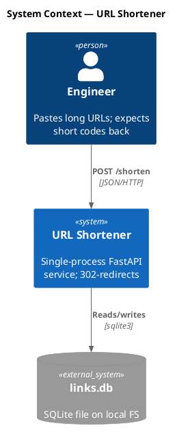
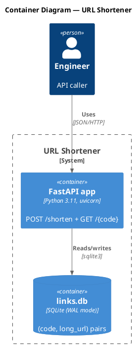
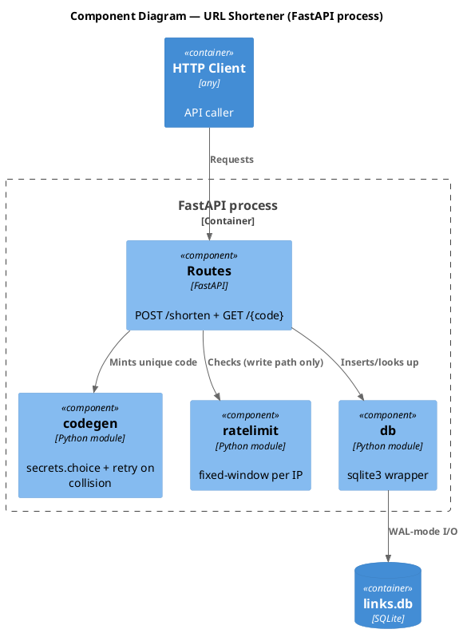
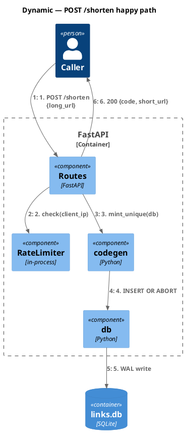
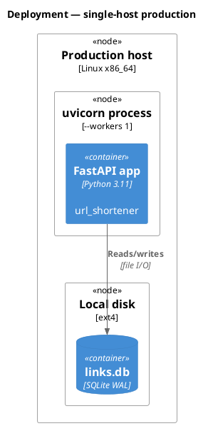
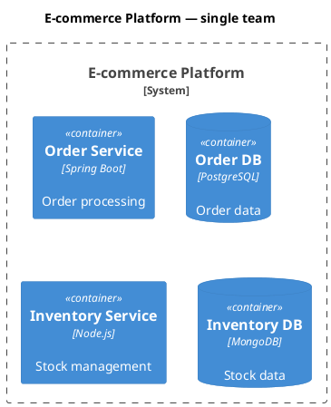
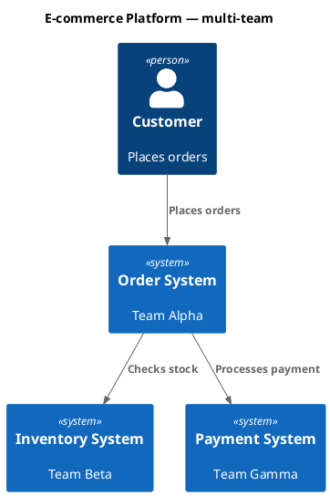
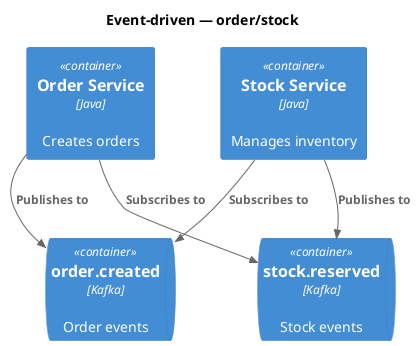

# C4 Architecture Documentation (PlantUML)

Generate software architecture documentation using C4 model diagrams in PlantUML syntax via the C4-PlantUML standard library.

## Workflow

1. **Understand scope** — Determine which C4 level(s) are needed based on audience.
2. **Analyze codebase** — Explore the system to identify components, containers, and relationships.
3. **Generate diagrams** — Create C4-PlantUML diagrams at appropriate abstraction levels.
4. **Render** — Convert `.puml` source to `.svg` via the `/plantuml` skill (`scripts/convert_puml.py`).

## MUST / MUST-NOT (binding)

Every C4 `.puml` file authored under this skill MUST:
- Start with `!include <C4/C4_Context|C4_Container|C4_Component|C4_Dynamic|C4_Deployment>` (after `@startuml`), and carry a `title` line.
- Use stdlib macros: `Person`/`System`/`Container`/`Component` (plus `*_Ext`/`*Db`/`*Queue`/`*_Boundary` variants) for elements; `Rel(...)` for relationships.

Every C4 `.puml` file MUST NOT:
- Use raw PlantUML primitives (`rectangle`/`actor`/`component`/`package`/`node`/`database`) for body elements — they have no C4 type semantics, so the element type (Person | Software System | Container | Component) becomes invisible to the reader.
- Use raw arrow syntax (`-->`/`->`/`..>`) or generic relationship verbs ("Uses", "Calls"). `Rel(...)` enforces the labeled-unidirectional rule; action verbs ("Sends payment intent via HTTPS/JSON") carry the meaning.
- Use `skinparam` for body styling. Use `UpdateElementStyle()` / `UpdateRelStyle()` instead, or accept the stdlib defaults.

## C4 Diagram Levels

| Level | Diagram type | Audience | Shows | When to create |
|-------|-------------|----------|-------|----------------|
| 1 | **C4_Context** | Everyone | System + external actors | Always (required for SAD) |
| 2 | **C4_Container** | Technical | Apps, databases, services | Always (required for SAD) |
| 3 | **C4_Component** | Developers | Internal components | Required for TDD |
| 4 | **C4_Deployment** | DevOps | Infrastructure nodes | For production systems |
| — | **C4_Dynamic** | Technical | Request flows (numbered) | For complex workflows; required for TDD critical-path sequences |

**Key insight:** "Context + Container diagrams are sufficient for most software development teams." Only generate Component/Deployment diagrams when they add genuine value.

## Quick Start Examples

Each example uses the C4-PlantUML stdlib via `!include` directives. The stdlib ships with PlantUML; no extra install needed.

### System Context (Level 1)



### Container Diagram (Level 2)



### Component Diagram (Level 3)



### Dynamic Diagram (request flow)



### Deployment Diagram



## Element Syntax

C4-PlantUML stdlib macros:

### People and systems

```
Person(alias, "Label", "Description")
Person_Ext(alias, "Label", "Description")          ' External person
System(alias, "Label", "Description")
System_Ext(alias, "Label", "Description")           ' External system
SystemDb(alias, "Label", "Description")             ' Database system
SystemQueue(alias, "Label", "Description")          ' Queue system
SystemDb_Ext(alias, "Label", "Description")         ' External DB
```

### Containers

```
Container(alias, "Label", "Technology", "Description")
Container_Ext(alias, "Label", "Technology", "Description")
ContainerDb(alias, "Label", "Technology", "Description")
ContainerQueue(alias, "Label", "Technology", "Description")
```

### Components

```
Component(alias, "Label", "Technology", "Description")
Component_Ext(alias, "Label", "Technology", "Description")
ComponentDb(alias, "Label", "Technology", "Description")
```

### Boundaries

```
Enterprise_Boundary(alias, "Label") { ... }
System_Boundary(alias, "Label") { ... }
Container_Boundary(alias, "Label") { ... }
Boundary(alias, "Label", "type") { ... }
```

### Relationships

```
Rel(from, to, "Label")
Rel(from, to, "Label", "Technology")
BiRel(from, to, "Label")                            ' Bidirectional
Rel_U(from, to, "Label")                            ' Upward
Rel_D(from, to, "Label")                            ' Downward
Rel_L(from, to, "Label")                            ' Leftward
Rel_R(from, to, "Label")                            ' Rightward
```

### Deployment nodes

```
Deployment_Node(alias, "Label", "Type", "Description") { ... }
Node(alias, "Label", "Type", "Description") { ... }     ' Shorthand (alias of Deployment_Node)
```

## Styling and Layout

### Layout direction (PlantUML stdlib)

```
LAYOUT_TOP_DOWN()                ' default
LAYOUT_LEFT_RIGHT()
LAYOUT_LANDSCAPE()
LAYOUT_AS_SKETCH()               ' hand-drawn look
```

### Element-level styling

```
UpdateElementStyle("alias", $bgColor="grey", $fontColor="red", $borderColor="red")
```

### Relationship styling

```
UpdateRelStyle("from", "to", $textColor="blue", $lineColor="blue", $offsetX="5", $offsetY="-10")
```

`$offsetX` / `$offsetY` fix overlapping relationship labels.

## Best Practices

### Essential rules

1. **Every element MUST have**: name, type, technology (where applicable), description.
2. **Use unidirectional arrows only** — bidirectional arrows create ambiguity.
3. **Label arrows with action verbs** — "Sends email using", "Reads from", not just "uses".
4. **Include technology labels** — "JSON/HTTPS", "JDBC", "gRPC".
5. **Stay under 20 elements per diagram** — split complex systems into multiple diagrams.

### Clarity guidelines

1. **Start at Level 1** — context diagrams help frame the system scope.
2. **One diagram per file** — keep diagrams focused on a single abstraction level.
3. **Meaningful aliases** — use descriptive aliases (`orderService` not `s1`).
4. **Concise descriptions** — keep descriptions under 50 characters when possible.
5. **Always include a title** — `title System Context — <System Name>`.

### What to avoid

- Confusing containers (deployable) vs components (non-deployable).
- Modeling shared libraries as containers.
- Showing message brokers as a single container instead of individual topics.
- Adding undefined abstraction levels like "subcomponents".
- Removing type labels to "simplify" diagrams.
- Modeling **framework internals as components** (servlet container, dispatcher servlet, HTTP message converter, ORM session factory, framework HTTP clients). See "Framework internals are NOT components" below.
- Drawing a Component diagram for a single-component container — write `<!-- OMIT: trivial container; single component -->` in the TDD instead and set `component_count: 0`.
- Mixing transport/protocol detail into a **System Context (L1)** relationship label. L1 is for execs/PMs — strip protocols (`(HTTP, loopback)`, `JDBC`, etc.) and move them to L2 Container.
- Putting load balancers, replicas, K8s pods on a **Container** diagram — that's Deployment territory. Container = logical, not physical.

### Framework internals are NOT components

A Component is "a grouping of related functionality encapsulated behind a well-defined interface" — i.e., **your application's** groupings, not the framework's. The following are forbidden as components on a C4 Component diagram:

| Forbidden as component | Why |
|---|---|
| Servlet container (Tomcat, Jetty, Undertow) | Runtime infrastructure. If it matters at all, it's a Container. |
| `DispatcherServlet`, `FrontController` | Framework routing — implicit in any Spring/Rails/Flask/Express app. |
| HTTP message converters (Jackson, Gson, `MappingJackson2HttpMessageConverter`) | Serialization plumbing. |
| ORM `SessionFactory` / `EntityManagerFactory` | Framework-supplied infrastructure. |
| Framework HTTP clients (`RestTemplate`, `WebClient`, `OkHttpClient`) used as standalone boxes | These are libraries used inside your component, not components themselves. |

The arrow chain `Tomcat → DispatcherServlet → MyController → Jackson → Client` is request-flow narration, not structure. If you need to show that flow, draw it with `!include <C4/C4_Dynamic>` and numbered `Rel`s — not on a Component diagram.

### Component diagrams are optional

A Component diagram should answer a specific question (e.g., "How does retry vs fail-fast work inside the Payment API?"). If no such question exists, do not draw one.

- **Container with one application class** (e.g., a single `@RestController`): the Component diagram would be one box. Skip it. Write `<!-- OMIT: trivial container; single component -->` in the TDD `S-COMPONENTS-001` section and set frontmatter `component_count: 0`. Mirrors the existing pattern for omitted state-machines (`<!-- OMIT: no lifecycle states -->` with `state_machine_count: 0`).
- **Long-lived containers**: prefer auto-generation (Structurizr DSL or annotation-driven). Hand-drawn component diagrams rot.

## Microservices guidelines

### Single-team ownership

Model each microservice as a **container** (or container group) inside one System_Boundary:



### Multi-team ownership

Promote microservices to **software systems** when owned by separate teams:



### Event-driven architecture

Show individual topics/queues as containers, NOT a single "Kafka" box:



## Output location

Write `.puml` source under the **owning artifact's `diagrams/` directory**, then render to `.svg` with the `/plantuml` skill:

| Owning artifact | Diagram source path |
|---|---|
| `architecture/SAD.md` | `architecture/diagrams/sad-c4-context.puml` + `sad-c4-container.puml` |
| `pipeline/<NNN>-<slug>/design/<NNN>-TDD.md` | `pipeline/<NNN>-<slug>/design/diagrams/tdd-c4-component.puml` |
| `pipeline/<NNN>-<slug>/interfaces/<NNN>-CONTRACT.md` | `pipeline/<NNN>-<slug>/interfaces/diagrams/contract-sequence-<crit>.puml` |

Render command (one-shot):

```bash
python ${CLAUDE_PLUGIN_ROOT}/skills/plantuml/scripts/convert_puml.py <path>.puml --format svg
```

The hash-stamper hook tracks both `.puml` source hash and rendered `.svg` hash in the artifact's paired `<artifact>.lock.yaml diagrams[]` block.

## Audience-appropriate detail

| Audience | Recommended diagrams |
|----------|---------------------|
| Executives | System Context only |
| Product Managers | Context + Container |
| Architects | Context + Container + key Components |
| Developers | All levels as needed |
| DevOps | Container + Deployment |

## Self-check before rendering

Before invoking `/plantuml`, walk this checklist. Any "no" → fix the source, do not render.

- [ ] **Title** present (e.g., `title C4 Level 2 — Containers — hello-world`).
- [ ] **Stdlib `!include`** used; no raw `rectangle`/`actor`/`component`/`package` in the body.
- [ ] **Every element** has name (1st arg), type-by-macro (`Person`/`System`/`Container`/`Component`, not just hinted in the label), description (last arg), and technology (3rd arg, for Container/Component).
- [ ] **L1 Context**: no transport protocols on relationships. **L3 Component**: no framework internals (see forbidden table above).
- [ ] **Every `Rel(...)`** has a label, plus a technology arg at Container/Component level, action verb (no "Uses"/"Calls"/"Talks to"), unidirectional (no `BiRel` unless genuinely peer-to-peer).
- [ ] **Stand-alone test**: handed the rendered `.svg` to a stranger — can they tell what the system does, who uses it, and how it's built, without your narration?

If any check fails: fix the `.puml` first. Rendering does not fix violations.

## Summary

1. **Pick level** — start with C4_Context (Level 1) and C4_Container (Level 2).
2. **Write `.puml`** — `!include <C4/C4_Container>` then macros (`Person`, `Container`, `Rel`).
3. **Render** — `python skills/plantuml/scripts/convert_puml.py <path>.puml --format svg`.
4. **Embed** — image link `` in the owning artifact.
5. **Stay disciplined** — one level per file; under 20 elements; technology labels everywhere; run the self-check checklist before render.
