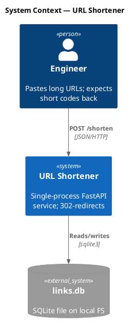
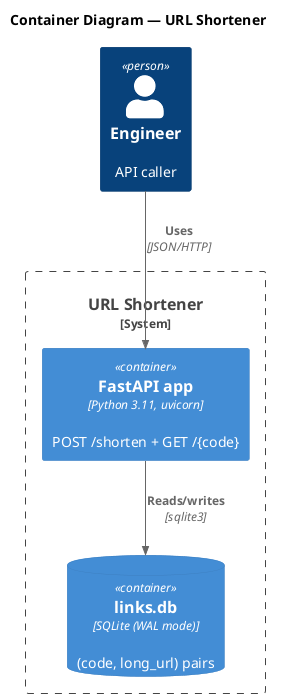
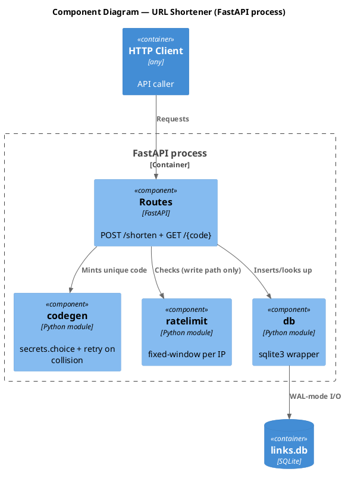
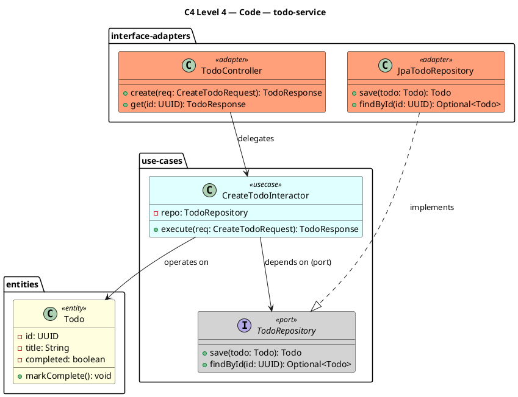
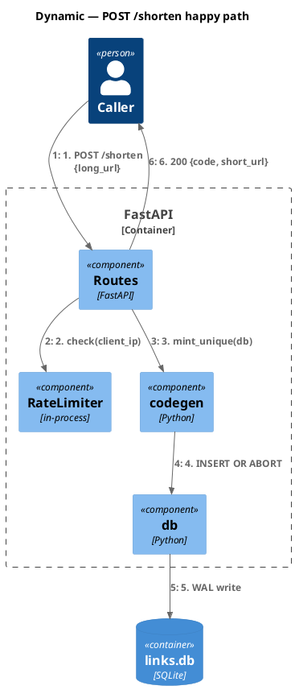
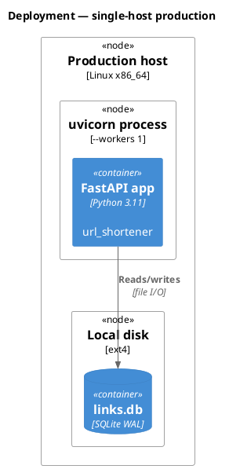

# c4-architecture

Generates C4-model diagrams (Context / Container / Component / Deployment / Dynamic) in PlantUML via the C4-PlantUML stdlib. `@lead` invokes when authoring SAD or TDD diagrams.

## When to use

- `@architect` authoring `docs/SAD.md` — needs Context (L1) + Container (L2).
- `@lead` authoring `docs/<feature-id>/<feature-id>-TDD.md` — needs Component (L3) and/or Dynamic flow diagrams.
- `@lead` authoring `docs/<feature-id>/<feature-id>-openapi.yaml` — needs sequence diagrams for critical-path criteria.

## Approach

### Step 1 — Pick C4 level by audience

| Level | Diagram | Audience | Shows | When to create |
|---|---|---|---|---|
| 1 | **C4_Context** | Everyone | System + external actors | Always (required for SAD); per-feature highlighted copy on feature impact |
| 2 | **C4_Container** | Technical | Apps, databases, services | Always (required for SAD); per-feature highlighted copy on feature impact |
| 3 | **C4_Component** | Developers | Internal components of one container | Required for TDD; per-feature highlighted copy on feature impact |
| 4 | **C4_Code** | Backend devs | Class structure of one component (Controller / Service / Repository / Entity) | Required for TDD under Full rigor; aligned to clean-architecture concentric circles |
| — | **C4_Dynamic** | Technical | Numbered request flows | Complex workflows; required for TDD critical-path sequences |
| — | **C4_Deployment** | DevOps | Infrastructure nodes | Production systems only |

L1 + L2 + L3 are mandatory under Full rigor (L1 + L2 under Standard); L4 ships when chain_rigor=Full and component count ≥ 2 (omit per Step 4 protocol when trivial). Deployment is opt-in for production topologies.

### Step 1b — Zoom continuity protocol (MANDATORY before any non-context level)

C4 only works as a model when the child diagram is a literal zoom into one specific element of the parent. A reader scrolling from L(n-1) to L(n) must be able to trace which box opened up. Skipping this protocol produces the three most common authoring failures:

- **No `*_Boundary` wrap carrying the parent box name** → the child's contents float at the top level; the L(n-1) system identity vanishes; reader cannot see "this is what's inside the parent box."
- **External-actor drift across the seam** → an actor / `System_Ext` / sibling-container on the parent's seam is silently dropped, renamed, or merged at the child level.
- **Wrong outer-wrap macro for the level.** L2 wraps the system with `System_Boundary`; sub-tiers inside the system use generic `Boundary(<id>, "<tier>", "tier") { ... }`. L3 wraps the container with `Container_Boundary`. The two failures are symmetric: using `Container_Boundary` at top level of L2 (to subdivide the system) is structurally invalid, AND using `System_Boundary` at top level of L3 (because the L2 box "feels like a system") is equally invalid. `Container_Boundary` belongs only at L3; `System_Boundary` belongs only at L2 (or for nested sub-systems whose own L2 zoom exists).

Run these four steps in order — none can be skipped:

**1. Read the parent `.puml`.** L2 → Read `c4-context.puml`. L3 → Read `c4-container.puml` (for the service being zoomed) and `c4-context.puml` (to confirm the seam-crossing actor set). L4 → Read the matching `c4-component[-<service>].puml`. (L1 has no parent — start at step 2 only when authoring L1.) Without the Read, none of the remaining steps can be verified.

**2. Wrap the child body with the parent box's name verbatim.** L1 → L2: wrap the L2 container set in `System_Boundary(<id>, "<L1 system name>") { ... }`. L2 → L3: wrap the L3 components in `Container_Boundary(<id>, "<L2 container name>") { ... }`. The boundary label MUST equal the parent box's name character-for-character (case + punctuation included) — no rephrasing.
   - **L2 NEVER uses `Container_Boundary` for sub-system grouping.** If the system has internal tiers (e.g., channel-layer / core / commerce / financial / platform), wrap them in generic `Boundary(<id>, "<tier name>", "tier") { ... }` *inside* the outer `System_Boundary`. Reserve `Container_Boundary` strictly for L3.

**3. Carry every seam-crossing actor + neighbor verbatim.** Every `Person(...)` / `System_Ext(...)` / `ContainerDb_Ext(...)` / sibling-container reference that crosses the zoom boundary in the parent MUST appear in the child with identical id, label, and description. No renaming (`User` → `Customer`), no dropping ("we only need 3 of 5"), no merging. If the parent shows it on the seam, the child shows it on the seam.

**4. Highlight the zoom-target on the parent.** On the parent `.puml`, apply `UpdateElementStyle(<zoom-target-id>, $bgColor="#1168bd", $borderColor="#0b4884", $fontColor="white")` (or `AddElementTag("focused", ...)` + `$tags="focused"` on the element if the stdlib variant prefers tags) to the element the child diagram opens up. Reader scrolling L(n-1) → L(n) sees a visually distinct box on the parent and matches it to the child's `*_Boundary` name. Service-level singletons get this highlight once per child diagram authored against them; the highlight is permanent (not feature-scoped) and stays across runs.

If any step 1–4 fails — no Read, wrong / missing boundary, dropped actor, no highlight — the parent → child trace is broken and the child reads as a free-floating diagram. Reviewer flags as Major; promote to structural failure if the chain breaks at ≥2 levels.

#### Worked counter-examples

L1→L2 and L2→L3 traps with WRONG / RIGHT side-by-side `.puml` blocks (abstract placeholders, not domain-specific) live in `references/c4-rules.md` `## Zoom-continuity counter-examples`. Read both before drafting your first non-context level — they show what each of the three failure modes above looks like in source.

### Step 2 — Apply MUST / MUST-NOT (binding)

Every C4 `.puml` MUST:

- Start with `!include <C4/C4_Context|C4_Container|C4_Component|C4_Dynamic|C4_Deployment>` after `@startuml`, plus a `title` line.
- Use stdlib macros: `Person` / `System` / `Container` / `Component` (plus `*_Ext` / `*Db` / `*Queue` / `*_Boundary` variants) for elements; `Rel(...)` for relationships.
- Use short, business-domain `Person` labels — `Client`, `Web`, `App`, `API client`, `Integrator`, `Mobile app`, `Admin user`, `Customer`, `Driver`, `Merchant`, `Operator`. A `Person` is a role that uses the *running system*. Inherit from PRD `S-PERSONAS-001` / SAD `S-CONTEXT-001`; do not invent meta-narrative stand-ins like `Developer-consumer` or `Reference-impl reader` (full rule: `schemas/pipeline-artifact.schema.md#body-discipline`).

Every C4 `.puml` MUST NOT:

- Use raw PlantUML primitives (`rectangle` / `actor` / `component` / `package` / `node` / `database`) for body elements — they have no C4 type semantics.
- Use raw arrow syntax (`-->` / `->` / `..>`) or generic verbs ("Uses" / "Calls"). `Rel(...)` enforces unidirectional + labeled.
- Use `skinparam` for body styling. Use `UpdateElementStyle()` / `UpdateRelStyle()` instead, or accept stdlib defaults.

### Step 3 — Author from quick-start templates

Six quick-start fenced templates below: Context (L1), Container (L2), Component (L3), Code (L4), Dynamic, Deployment. Use as starting points; element-syntax + styling-macro tables follow.

### Step 4 — Apply mandatory rules

Five essentials (extended discussion in `references/c4-rules.md`):

1. **Every element** has name, type-by-macro, technology (where applicable), description.
2. **Unidirectional arrows only** — `Rel(from, to, ...)`. No `BiRel` unless genuinely peer-to-peer.
3. **Action verbs** on labels — "Sends payment intent via" not "Uses".
4. **Technology labels** — "JSON/HTTPS", "JDBC", "gRPC".
5. **≤20 elements per diagram** — split when dense.

Component diagrams answer ONE specific question (e.g., "How does retry vs fail-fast work inside the Payment API?"). For trivial single-component containers, omit and write `<!-- OMIT: trivial container; single component -->` in TDD `S-COMPONENTS-001` with `component_count: 0`.

For framework internals (Tomcat, DispatcherServlet, Jackson, ORM `SessionFactory`, `RestTemplate` / `WebClient` as standalone boxes) — these are NOT components. See `references/c4-rules.md`. If you need to show that flow, draw it with `C4_Dynamic` and numbered `Rel`s.

For microservices ownership patterns (single-team / multi-team / event-driven), see `references/c4-rules.md`.

### Step 5 — Render

The `post-write-puml` hook fires on `.puml` writes and renders the paired `.svg` automatically. Commit both. CI parity check fails any `.puml` without a paired `.svg`. See `skills/plantuml/SKILL.md` for hook details and the manual-fallback command (only when the hook is intentionally disabled).

### Step 6 — Self-check before declaring done

Walk this checklist; any "no" → fix the source, do not render:

- [ ] **Re-read parent `.puml` before writing this child** (per Step 1b). For L2: open `c4-context.puml` and confirm the L2 `System_Boundary` label equals the L1 system name verbatim. For L3: open `c4-container.puml` and confirm the L3 `Container_Boundary` label equals the L2 container name verbatim. For L4: open the matching service-level `c4-component.puml` and confirm the L4 layer cake's outermost grouping matches the component the L4 zooms into. External actors + crossing-seam neighbors reused verbatim.
- [ ] **L2 macro discipline** — at L2 there is exactly ONE outermost `System_Boundary` (carrying the L1 system name); no `Container_Boundary` at top level. Internal tiers, if any, use generic `Boundary(<id>, "<tier>", "tier")` *inside* the `System_Boundary`. `Container_Boundary` appears only at L3.
- [ ] **Parent diagram highlights zoom-target** (per Step 1b) — the box the child diagram opens up carries `UpdateElementStyle(..., $bgColor="#1168bd", ...)` on the parent `.puml`, so a reader scrolling L(n-1) → L(n) can trace continuity.
- [ ] **Title** present (e.g., `title C4 Level 2 — Containers — hello-world`).
- [ ] **Stdlib `!include`** used; no raw `rectangle` / `actor` / `component` / `package` / `node` / `database` in body.
- [ ] **Every element**: name (1st arg), type-by-macro (`Person` / `System` / `Container` / `Component`, not just hinted in label), description (last arg), technology (3rd arg for Container / Component).
- [ ] **L1 Context**: no transport protocols on relationships. **L3 Component**: no framework internals (see `references/c4-rules.md`).
- [ ] **Every `Rel(...)`**: label, technology arg at Container / Component level, action verb (no "Uses" / "Calls" / "Talks to"), unidirectional (no `BiRel` unless genuinely peer-to-peer).
- [ ] **Stand-alone test**: handed the rendered `.svg` to a stranger — can they tell what the system does, who uses it, how it's built, without your narration?
- [ ] **Two-folder rule**: project singleton at `docs/diagrams/c4-<noun>.puml` (where `<noun> ∈ context | container | component-<service> | code-<service>`) is unstyled; per-feature copy at `docs/<service_name>/<feature-id>/diagrams/<feature-id>-c4-<noun>.puml` differs ONLY in `UpdateElementStyle()` highlights — never in element identity.

## Quick-start templates

### Level 1 — System Context (`c4-context.puml`)



### Level 2 — Container (`c4-container.puml`)



### Level 3 — Component (`docs/<service_name>/diagrams/c4-component.puml`)



### Level 4 — Code (`docs/<service_name>/diagrams/c4-code.puml`)

PlantUML class diagram (no `C4_Code` macro exists in stdlib). Show **full layer cake** aligned to the `clean-architecture` skill's concentric circles: Controller (interface adapter) → Service / Use Case (application business rules) → Repository interface (use-case-defined port) → Repository implementation (interface adapter) → Entity (enterprise business rule). Inner classes know nothing about outer classes — same Dependency Rule the architecture review enforces.



Rules:
- Arrows point **inward** (Controller → UseCase → Port; Adapter ..|> Port; never UseCase → Adapter).
- Stereotypes mark layer: `<<entity>>`, `<<usecase>>`, `<<port>>`, `<<adapter>>`. The `clean-architecture` skill defines the layers; this diagram is the visual proof.
- Keep ≤15 classes per diagram. Split per service / per bounded context if larger.
- Omit when component has fewer than 3 classes (`<!-- OMIT: trivial code surface -->`); document `code_class_count: <N>` in TDD `S-COMPONENTS-001`.

### Dynamic Diagram (request flow)



### Deployment Diagram



## Output location — two folders, one source of truth

Diagrams live in **three** scopes: system-level singletons under `docs/diagrams/`, service-level singletons under `docs/<service_name>/diagrams/`, and per-feature copies of the system-level files under `docs/<service_name>/<feature-id>/diagrams/`.

### System-level: `<cwd>/docs/diagrams/`

Authored / updated by `@architect`. One file per logical scope; updated in place when a feature shifts the model.

| File | Owner | Scope |
|---|---|---|
| `c4-context.puml` | `@architect` | Whole system; latest |
| `c4-container.puml` | `@architect` | Whole system; latest |
| `erd-logical.puml` | `@architect` | Project entities |
| `sequence-inter-<flow>.puml` | `@architect` | Per cross-service flow |

### Service-level: `<cwd>/docs/<service_name>/diagrams/`

Authored / updated by `@lead`. One file per service per level — NOT per feature. Updated in place as features shift the component / class graph.

| File | Owner | Scope |
|---|---|---|
| `c4-component.puml` | `@lead` | Components inside this service (one per service) |
| `c4-code.puml` | `@lead` | Class structure for this service (one per service; omit when service has <3 classes) |

When a new feature adds or changes a `Component()` / `Rel()` / class line in service-level L3 or L4, leave a PlantUML line comment naming the feature: `' #<feature-id>` immediately above the changed line. Future runs can diff which feature touched which element; the comment carries provenance without polluting the rendered diagram.

### Per-feature: `<cwd>/docs/<service_name>/<feature-id>/diagrams/`

Authored by `@lead` per feature. **Copies** of the system-level L1 + L2 files with feature-touched elements highlighted, plus intra-service sequence + physical ERD. L3 + L4 are NOT copied per-feature — those live at service grain only.

| File | Source |
|---|---|
| `<feature-id>-c4-context.puml` | Copy of `c4-context.puml` + highlight |
| `<feature-id>-c4-container.puml` | Copy of `c4-container.puml` + highlight |
| `<feature-id>-seq-<usecase>.puml` | Per intra-service usecase (no system copy) |
| `<feature-id>-erd-physical.puml` | Per feature, only when persistence touched |

### Highlight protocol (per-feature copies)

In each per-feature copy, mark elements the feature impacts using stdlib styling:

```plantuml
UpdateElementStyle(<element-id>, $bgColor="LightSalmon", $borderColor="Red", $fontColor="Black")
UpdateRelStyle(<from>, <to>, $textColor="Red", $lineColor="Red")
```

System-level singletons stay unstyled; service-level L3 + L4 use line comments (`' #<feature-id>`) for feature provenance instead of color highlights. The per-feature L1 + L2 copies are what reviewers read to understand "what this feature changes at the system seam".

## When to escalate

- Microservice ownership crosses team lines mid-render → consult `references/c4-rules.md` for the multi-team pattern.
- Component diagram has nothing to show beyond a single class → omit per Step 4 protocol.
- Client requests a "subcomponent" or 5th-level abstraction → C4 forbids it; clarify scope or split into multiple Component diagrams.

## References

- `references/c4-rules.md` — extended "what to avoid", framework-internals deep table, microservices ownership patterns (single-team / multi-team / event-driven examples), full element-syntax reference, styling and layout macros.

## Worked example — Todo service, feature `001-todo-api`

1. `@architect` authors system-level singletons (first feature triggers SAD bootstrap): `docs/diagrams/c4-context.puml`, `docs/diagrams/c4-container.puml`.
2. `@lead` authors service-level singletons under the service folder: `docs/todo-service/diagrams/c4-component.puml`, `docs/todo-service/diagrams/c4-code.puml` (class diagram per L4 template).
3. `@lead` authors per-feature highlighted copies under `docs/todo-service/001-todo-api/diagrams/`: `001-todo-api-c4-context.puml`, `001-todo-api-c4-container.puml` (each adds `UpdateElementStyle(...)` for touched elements at the system seam), plus `001-todo-api-seq-create-todo.puml` (intra-service sequence) and `001-todo-api-erd-physical.puml` (persistence touched). No per-feature L3 / L4 copy — feature provenance for service-level diagrams lives in `' #001-todo-api` line comments on the changed lines of `c4-component.puml` / `c4-code.puml`.
4. `post-write-puml` hook renders every `.svg`. Embed system SVGs in `docs/SAD.md` (`S-CONTEXT-001` / `S-CONTAINERS-001`); embed service SVGs in the service's CSD (`docs/todo-service/todo-service-CSD.md`); embed feature SVGs in `docs/todo-service/001-todo-api/001-todo-api-TDD.md` (`S-COMPONENTS-001`).
5. Walk Step 6's checklist for every source. Per-feature L1 + L2 copies must differ from system singletons ONLY in styling — never in element identity.
