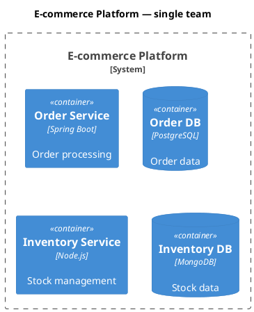
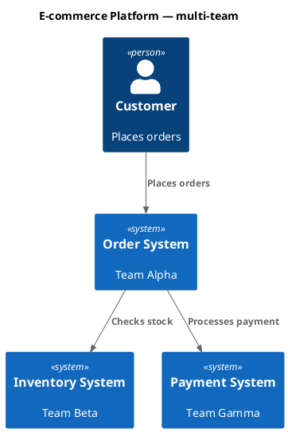
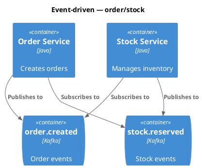

# C4 architecture — extended rules

Depth content moved out of `SKILL.md` to keep the skill body tight. Loaded only when actively authoring tricky cases.

## Framework internals are NOT components

A Component is "a grouping of related functionality encapsulated behind a well-defined interface" — i.e., **your application's** groupings, not the framework's. The following are forbidden as components on a C4 Component diagram:

| Forbidden as component | Why |
|---|---|
| Servlet container (Tomcat, Jetty, Undertow) | Runtime infrastructure. If it matters at all, it's a Container. |
| `DispatcherServlet`, `FrontController` | Framework routing — implicit in any Spring/Rails/Flask/Express app. |
| HTTP message converters (Jackson, Gson, `MappingJackson2HttpMessageConverter`) | Serialization plumbing. |
| ORM `SessionFactory` / `EntityManagerFactory` | Framework-supplied infrastructure. |
| Framework HTTP clients (`RestTemplate`, `WebClient`, `OkHttpClient`) used as standalone boxes | These are libraries used inside your component, not components themselves. |

The arrow chain `Tomcat → DispatcherServlet → MyController → Jackson → Client` is request-flow narration, not structure. If you need to show that flow, draw it with `!include <C4/C4_Dynamic>` and numbered `Rel`s — not on a Component diagram.

## Component diagrams are optional

A Component diagram answers ONE specific question (e.g., "How does retry vs fail-fast work inside the Payment API?"). If no such question exists, do not draw one.

- **Container with one application class** (single `@RestController`): the Component diagram is one box. Skip it. Write `<!-- OMIT: trivial container; single component -->` in TDD `S-COMPONENTS-001` and set frontmatter `component_count: 0`. Mirrors the existing pattern for omitted state-machines (`<!-- OMIT: no lifecycle states -->` with `state_machine_count: 0`).
- **Long-lived containers**: prefer auto-generation (Structurizr DSL or annotation-driven). Hand-drawn Component diagrams rot.

## "What to avoid" — extended

- Confusing containers (deployable) vs components (non-deployable).
- Modeling shared libraries as containers.
- Showing message brokers as a single container instead of individual topics.
- Adding undefined abstraction levels like "subcomponents".
- Removing type labels to "simplify" diagrams.
- Modeling framework internals as components (see table above).
- Drawing a Component diagram for a single-component container — omit per the protocol above.
- Mixing transport/protocol detail into a System Context (L1) relationship label. L1 is for execs/PMs — strip protocols (`(HTTP, loopback)`, `JDBC`, etc.) and move them to L2 Container.
- Putting load balancers, replicas, K8s pods on a Container diagram — that's Deployment territory. Container = logical, not physical.

## Microservices ownership patterns

### Single-team ownership

Model each microservice as a **container** (or container group) inside one System_Boundary:



### Multi-team ownership

Promote microservices to **software systems** when owned by separate teams:



### Event-driven architecture

Show individual topics/queues as containers, NOT a single "Kafka" box:



## Element-syntax reference (C4-PlantUML stdlib macros)

For edge cases not covered by `SKILL.md`'s 5 quick-start templates. Quick-start templates anchor typical use; this section is exhaustive.

### People and systems

```
Person(alias, "Label", "Description")
Person_Ext(alias, "Label", "Description")          ' External person
System(alias, "Label", "Description")
System_Ext(alias, "Label", "Description")          ' External system
SystemDb(alias, "Label", "Description")            ' Database system
SystemQueue(alias, "Label", "Description")         ' Queue system
SystemDb_Ext(alias, "Label", "Description")        ' External DB
```

### Containers

```
Container(alias, "Label", "Technology", "Description")
Container_Ext(alias, "Label", "Technology", "Description")
ContainerDb(alias, "Label", "Technology", "Description")
ContainerQueue(alias, "Label", "Technology", "Description")
```

### Components

```
Component(alias, "Label", "Technology", "Description")
Component_Ext(alias, "Label", "Technology", "Description")
ComponentDb(alias, "Label", "Technology", "Description")
```

### Boundaries

```
Enterprise_Boundary(alias, "Label") { ... }
System_Boundary(alias, "Label") { ... }
Container_Boundary(alias, "Label") { ... }
Boundary(alias, "Label", "type") { ... }
```

### Relationships

```
Rel(from, to, "Label")
Rel(from, to, "Label", "Technology")
BiRel(from, to, "Label")                            ' Bidirectional
Rel_U(from, to, "Label")                            ' Upward
Rel_D(from, to, "Label")                            ' Downward
Rel_L(from, to, "Label")                            ' Leftward
Rel_R(from, to, "Label")                            ' Rightward
```

### Deployment nodes

```
Deployment_Node(alias, "Label", "Type", "Description") { ... }
Node(alias, "Label", "Type", "Description") { ... }     ' Shorthand
```

## Styling and layout

For when stdlib defaults don't match the diagram's needs.

### Layout direction

```
LAYOUT_TOP_DOWN()                ' default
LAYOUT_LEFT_RIGHT()
LAYOUT_LANDSCAPE()
LAYOUT_AS_SKETCH()              ' hand-drawn look
```

### Element-level styling

```
UpdateElementStyle("alias", $bgColor="grey", $fontColor="red", $borderColor="red")
```

### Relationship styling

```
UpdateRelStyle("from", "to", $textColor="blue", $lineColor="blue", $offsetX="5", $offsetY="-10")
```

`$offsetX` / `$offsetY` fix overlapping relationship labels when the auto-layout collides them.
