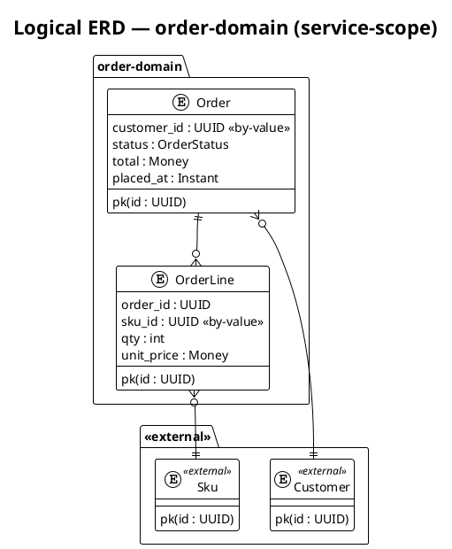

# Logical ERD authoring rules

Companion to `skills/c4-architecture/SKILL.md`. Read when authoring a `erd-logical.puml` source (workspace-scope or service-scope) or when grading one in review.

## Workspace-scope (`docs/diagrams/erd-logical.puml`)

- One PlantUML `package` per service-owned schema.
- Inside each package, one `entity` per aggregate root — NOT one per table.
- Entity body: `pk(<id> : TYPE)` first row, then key business attributes (~5 max — logical, not physical).
- Cross-aggregate references drawn as PlantUML arrows stereotyped `<<by-value>>` with explicit cardinality (`||--o{`, `}o--||`, etc.).
- No FK lines cross service boundaries.

## Service-scope (`docs/<service_name>/diagrams/erd-logical.puml`)

- Single service's aggregates + every upstream aggregate it references by value.
- Upstream entities stereotyped `<<external>>`.
- Same row syntax as workspace.

## Forbidden at either scope

- Physical column lists, indexes
- Audit-log tables
- Snapshot tables
- Prose-string columns

Those belong in `<feature-id>-erd-physical.puml` (per-feature, persistence-touching features only — gated by TDD `S-DATA-001`).

## Scope-routing

- `per-service` → service-scope ERD only, bind to BR-AC `diagrams:`.
- `system-wide` → workspace ERD covering every walked service, bind to SAD `diagrams:`; skip service-scope ERDs.

## Worked aggregate example

Aggregate-by-aggregate, not table-by-table — the diagram answers "what business concepts does this domain own?" without leaking physical schema choices.
