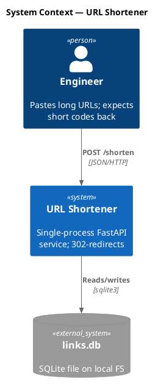
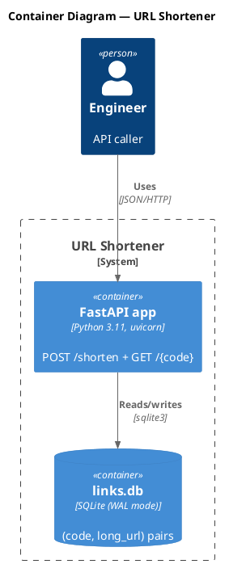
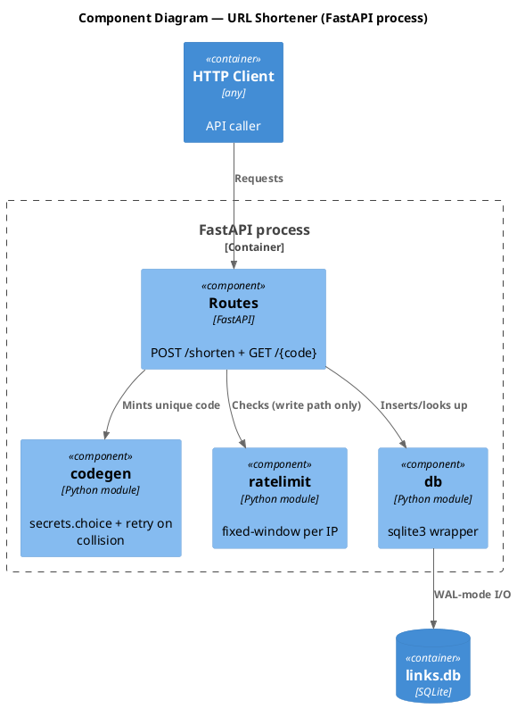
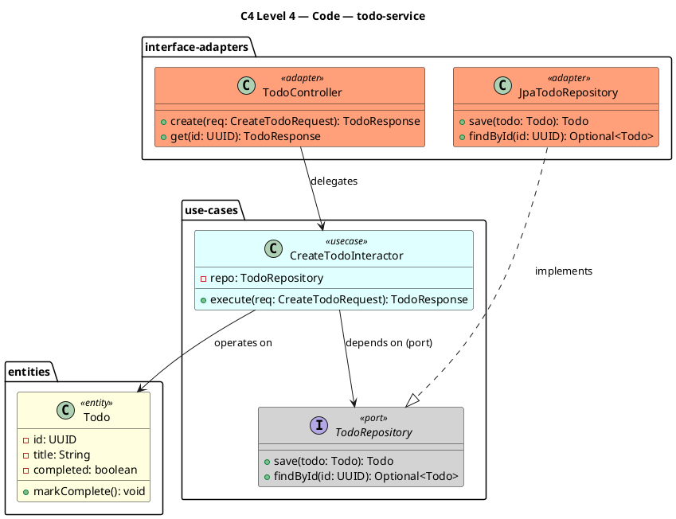
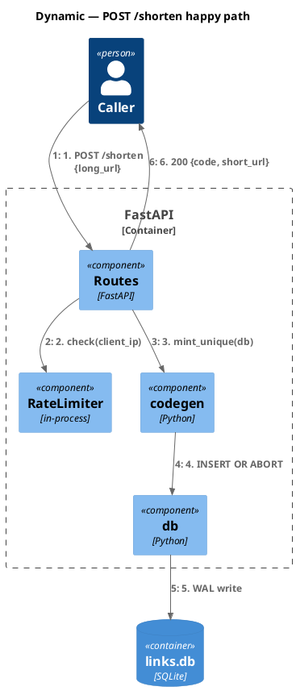
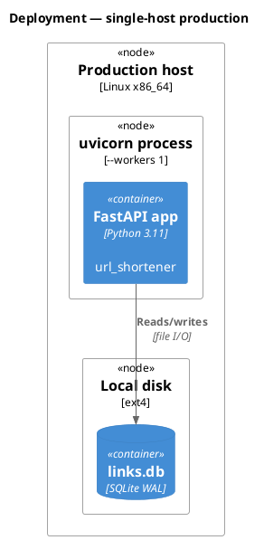

# C4-PlantUML quick-start templates

Six fenced templates, one per C4 level + Dynamic + Deployment. Use as starting points; element-syntax and styling-macro reference live in `c4-rules.md`.

Pick a template by audience and authoring scope:

- **L1 Context** — required for SAD; system + external actors only. No transport protocols on `Rel(...)`.
- **L2 Container** — required for SAD; apps, databases, services. Exactly one outermost `System_Boundary` carrying the L1 system name.
- **L3 Component** — required for service-level singleton `docs/<service_name>/diagrams/c4-component.puml`. Wrap body in `Container_Boundary(<id>, "<L2 container name>")`.
- **L4 Code** — PlantUML class diagram (no `C4_Code` macro in stdlib). Layered per the `clean-architecture` skill's concentric circles. Omit when service has <3 classes.
- **Dynamic** — numbered request flows. One per critical-path sequence in TDD.
- **Deployment** — production topology only. Opt-in.

## Level 1 — System Context (`c4-context.puml`)



## Level 2 — Container (`c4-container.puml`)



## Level 3 — Component (`docs/<service_name>/diagrams/c4-component.puml`)



## Level 4 — Code (`docs/<service_name>/diagrams/c4-code.puml`)

PlantUML class diagram (no `C4_Code` macro exists in stdlib). Show the **full layer cake** aligned to the `clean-architecture` skill's concentric circles: Controller (interface adapter) → Service / Use Case (application business rules) → Repository interface (use-case-defined port) → Repository implementation (interface adapter) → Entity (enterprise business rule). Inner classes know nothing about outer classes — same Dependency Rule the architecture review enforces.



L4 rules:

- Arrows point **inward** (Controller → UseCase → Port; Adapter ..|> Port; never UseCase → Adapter).
- Stereotypes mark layer: `<<entity>>`, `<<usecase>>`, `<<port>>`, `<<adapter>>`. The `clean-architecture` skill defines the layers; this diagram is the visual proof.
- ≤15 classes per diagram. Split per service / per bounded context if larger.
- Omit when component has fewer than 3 classes (`<!-- OMIT: trivial code surface -->`); document `code_class_count: <N>` in TDD `S-COMPONENTS-001`.

## Dynamic Diagram (request flow)



## Deployment Diagram



## Highlight protocol (per-feature copies)

In each per-feature copy under `docs/<service_name>/<feature-id>/diagrams/`, mark elements the feature impacts using stdlib styling:

```plantuml
UpdateElementStyle(<element-id>, $bgColor="LightSalmon", $borderColor="Red", $fontColor="Black")
UpdateRelStyle(<from>, <to>, $textColor="Red", $lineColor="Red")
```

System-level singletons stay unstyled; service-level L3 + L4 use line comments (`' #<feature-id>`) for feature provenance instead of color highlights.
