# Sequence Diagrams

Sequence diagrams illustrate how participants interact over time, showing the flow of messages and temporal ordering of events. They excel at documenting interaction protocols, communication flows, and complex multi-actor processes.

## Basic Syntax

The simplest sequence diagram declares participants and defines messages between them. Participants can be implicit (created on first mention) or explicit (declared with the `participant` keyword for more control):

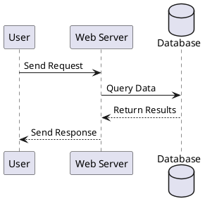

## Header Prelude

A repeatable starter prelude that pays off on diagrams larger than a handful of arrows:

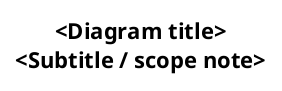

- `responseMessageBelowArrow true` — response label renders below the arrow, so paired request/response reads vertically.
- `maxMessageSize 300` — long parameter lists wrap inside the label box instead of stretching the lifeline.
- `sequenceArrowThickness 1.5` — arrows stay readable at SVG zoom-out.

## Participant Types

PlantUML supports specialized participant types beyond standard boxes:

- `participant` - Standard rectangular box
- `actor` - Stick figure for human actors
- `boundary` - System boundary representation
- `control` - Control/logic component
- `entity` - Data entities
- `database` - Database systems
- `collections` - Collection of items
- `queue` - Message queues

**Example:**

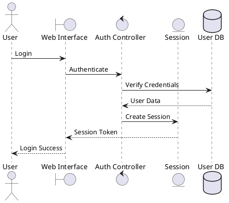

## Participant Customization

### Renaming with Aliases

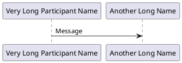

### Controlling Order

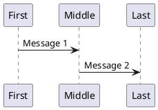

### Multiline Participant Names

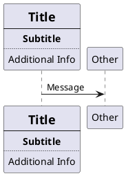

### Colored Participants

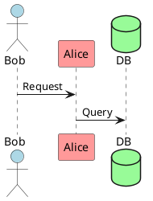

### Color-coding by Architecture Layer

Group participants left-to-right by architecture layer and color-code by layer for fast visual scan. Color choices are repo-local convention, not part of PlantUML grammar.

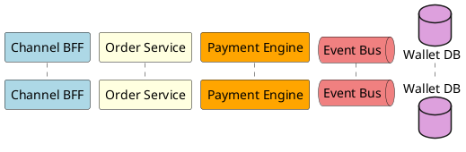

Common layering: channel → domain → platform → external. Keep aliases short (3–4 chars) so message labels stay legible.

## Activation and Lifelines

Activation (lifelines) shows when a participant is active or processing:

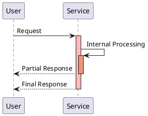

### Shorthand Activation Syntax

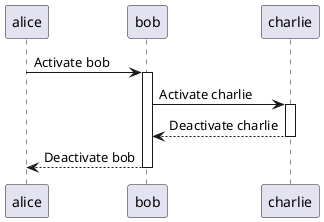

### Creation and Destruction

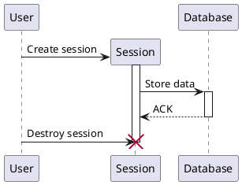

## Message Types and Arrows

PlantUML supports various message arrow styles:

- `->` Solid arrow (synchronous message)
- `-->` Dashed arrow (return/async message)
- `->>` Asynchronous message
- `<-` Reverse solid (for code readability)
- `<--` Reverse dashed
- `-\\` Lost message (message that doesn't reach destination)
- `/-` Found message (message from unknown source)
- `->x` Message with destruction
- `->o` Message to boundary
- `->>o` Async message to boundary

**Example:**

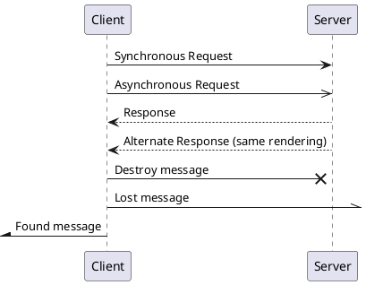

## System Boundary Messages

Messages from/to system boundaries:

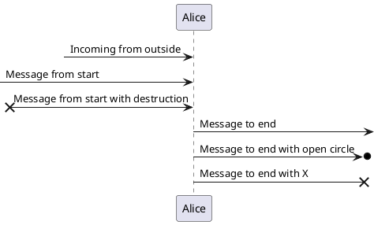

## Messages to Self

Show internal processing:

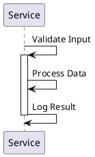

## Request / Response Payload Shape

**Lead rule: every synchronous request arrow must have a paired response arrow.** A one-way call with no response is a fire-and-forget — render it with `->>` to signal that explicitly. Pairing makes blocking semantics readable without scanning surrounding context.

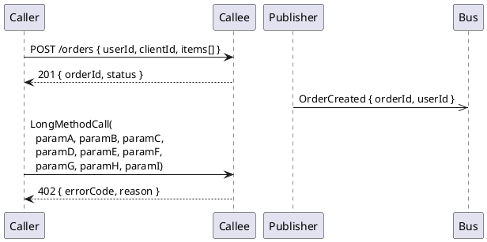

### Field-name skeleton vs example values

Both shapes are valid PlantUML. Pick by purpose:

- **Field names only** — `{ userId, clientId, items[] }`. Contract shape, survives schema evolution. Default for inter-service / public-API diagrams where the body shape lifts from `openapi.yaml` / `asyncapi.yaml`.
- **Example values** — `{ userId: 12345, status: "PAID" }`. Use when a concrete value carries meaning the field name does not: seed inputs for a worked example, enum literals (`status: "PAID"`), HTTP status codes (`201`, `402`), idempotency-key shape (`Idempotency-Key: <orderId>`).

Avoid arbitrary placeholder values (`userId: 12345` chosen for no reason) — they drift on every edit and add no contract information.

## Grouping and Control Structures

### Alt/Else (Alternative Paths)

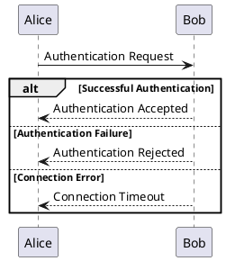

### Opt (Optional)

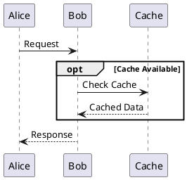

### Loop

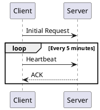

### Par (Parallel)

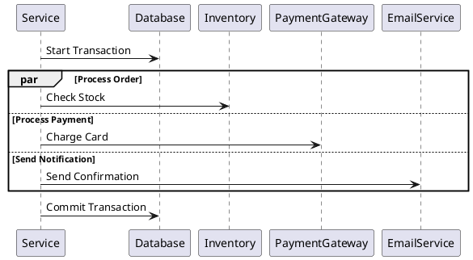

### Group

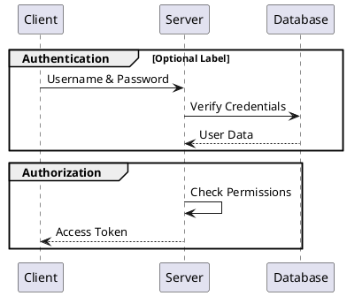

### Break (Early Exit)

`break` exits the enclosing fragment on a guard condition — useful for guard-and-bail validation paths.

```puml
@startuml
alt request valid
    Caller -> Callee : Process
else invalid input
    break
        Caller -> Caller : LogReject
    end
end
@enduml
```

### Critical (Protected Region)

`critical` marks a region that must not be interrupted (atomic write pair, transactional bracket). Optional fallback branches use `else` like `alt`.

```puml
@startuml
critical Atomic write pair
    ServiceA -> StoreA : WriteA
    ServiceA -> StoreB : WriteB
end
@enduml
```

See `references/troubleshooting/sequence_diagrams_guide.md` for common parse errors with both fragments.

## Notes and Annotations

### Basic Notes

```puml
@startuml
Alice -> Bob : Message
note left: This is a note on the left side
note right: This is a note on the right side
note over Alice: Note over Alice
note over Alice, Bob
    This note spans across
    both Alice and Bob
end note
@enduml
```

### Note Styles

```puml
@startuml
Alice -> Bob : Message
note left #lightblue: Colored note

hnote over Alice : Hexagonal note
rnote over Bob : Rectangle note
@enduml
```

### Notes on Messages

```puml
@startuml
Alice -> Bob : Message
note on link
    This note is directly
    on the message arrow
end note
@enduml
```

## Spacing and Formatting

### Manual Spacing

```puml
@startuml
Alice -> Bob : Message 1

|||

Alice -> Bob : Message 2 (with automatic spacing)

||50||

Alice -> Bob : Message 3 (with 50 pixels spacing)
@enduml
```

### Dividers

```puml
@startuml
== Initialization ==
Alice -> Bob : Connect

== Authentication ==
Alice -> Bob : Login
Bob --> Alice : Token

== Data Transfer ==
Alice -> Bob : Request Data
Bob --> Alice : Send Data

== Cleanup ==
Alice -> Bob : Disconnect
@enduml
```

### Delay Marker

```puml
@startuml
Alice -> Bob : Request
...5 minutes later...
Bob --> Alice : Response

...
Alice -> Bob : Another Request
@enduml
```

## Advanced Features

### Reference to Other Diagrams

```puml
@startuml
participant Alice
participant Bob

ref over Alice, Bob : Complex Authentication Process\n(see auth_detail.puml)

Alice -> Bob : Continue with main flow
@enduml
```

For the orchestra reuse convention (canonical `SD-<id>` naming, step-number reuse, `grep` marker, `note over` fallback), see the "Orchestra authoring discipline" section near the end of this file.

### Numbered Messages

```puml
@startuml
autonumber
Alice -> Bob : First message
Bob --> Alice : Response
Alice -> Bob : Second message
Bob --> Alice : Response
@enduml
```

**Customized Numbering:**

```puml
@startuml
autonumber 10 10 "<b>[000]"
Alice -> Bob : Message 10
Bob --> Alice : Response 20
autonumber stop
Alice -> Bob : No number
autonumber resume
Alice -> Bob : Message 30
@enduml
```

### Message Delays

```puml
@startuml
Alice -> Bob : Request
... 5 minutes later ...
Bob --> Alice : Response
@enduml
```

### Step Labels and Compensation Markers

Free-text bracketed labels inside message text (`[1]`, `[2]`, …) are a convention, not a PlantUML keyword. They let prose cross-reference a specific arrow without re-counting. `autonumber` (see *Numbered Messages*) is the automatic alternative when sequence order matters more than narrative anchoring.

```puml
@startuml
' Sequential step labels (manual)
Caller -> Callee : [1] ValidateInput
Callee -> Store  : [2] LoadProfile

' Compensation / saga reversal markers — reverse order from the forward path
ServiceA -> StoreA : [Comp-3] RevertA
ServiceA -> StoreB : [Comp-2] RevertB
@enduml
```

`[Comp-N]` is the same mechanism with a convention overlay for compensation / saga-reversal paths — the number mirrors the forward step it undoes, so a forward `[3] WriteA` pairs with a reverse `[Comp-3] RevertA`.

For pointing at a sub-flow that lives in a separate `.puml`, use `ref over` (see *Reference to Other Diagrams* above) — keeps the current diagram from inlining 30 steps of a tangential branch.

## Real-World Example: Authentication Flow

```puml
@startuml
actor User
participant "Web App" as Web
participant "Auth Service" as Auth
database "User DB" as DB
participant "Email Service" as Email

User -> Web : Enter credentials
activate Web

Web -> Auth : Authenticate(username, password)
activate Auth

Auth -> DB : Query user by username
activate DB
DB --> Auth : User record
deactivate DB

alt Password Valid
    Auth -> Auth : Generate JWT token
    Auth -> DB : Update last_login
    activate DB
    DB --> Auth : Success
    deactivate DB

    Auth --> Web : JWT token
    deactivate Auth

    Web --> User : Redirect to dashboard
    deactivate Web

    par Send notification
        Auth -> Email : Send login notification
        activate Email
        Email --> Auth : Email sent
        deactivate Email
    end

else Password Invalid
    Auth --> Web : Authentication failed
    deactivate Auth

    Web --> User : Show error message
    deactivate Web

    alt Too many failures
        Web -> Auth : Lock account
        activate Auth
        Auth -> DB : Set account_locked = true
        activate DB
        DB --> Auth : Success
        deactivate DB
        Auth -> Email : Send security alert
        activate Email
        Email --> Auth : Email sent
        deactivate Email
        deactivate Auth
    end
end
@enduml
```

## Orchestra authoring discipline

Apply two content rules to every sequence diagram authored under orchestra (`*-sd-*.puml`, `sequence-intra-*.puml`, `sequence-inter-*.puml`): an **Operations Summary** of infrastructure side-effects, and **`ref` block reuse** for shared sub-flows.

### Operations Summary tables

List the six tables below when the flow touches the resource. Each table captures one class of infrastructure side-effect: cache TTLs (Redis), lock blast-radius (Locks), DB writes (Database Tables), producer/consumer topology (Kafka), state transitions (State machine), API surface (Endpoint Index).

| Table | Columns |
|---|---|
| Redis Keys | Key pattern · Purpose · TTL · Marker |
| Kafka Topics | Topic · Producer · Consumer |
| Database Tables | Database · Table · Operation · Key Fields · Marker |
| Lock Patterns | Lock Key · Type · TTL · On Failure |
| State machine | States · Workflow |
| API endpoint Index | #ID · Caller · Callee · Method + Path · Contract File |

The `Marker` column (Redis Keys, Database Tables) carries `★SoT` for write-failure-blocks-flow stores and `◇Best-effort` for failure-logged-not-blocking stores; omit the column when the diagram doesn't ship SoT-marked `hnote`s.

Placement — two surfaces:

- **Sibling markdown** — `docs/<service_name>/<feature-id>/<feature-id>-sd-<seq>.puml` ships next to `<feature-id>-sd-<seq>-ops.md` carrying the six tables.
- **In-diagram tail** — same six tables encoded inline as a `note over <first>, <last>` block at end of the `.puml`. Either surface satisfies the discipline; ship both when one audience consumes the markdown and another consumes the rendered `.svg`.

Empty tables omitted; an absent table means "this flow does not touch that surface" — explicit not-applicable, not silent omission. When a table applies but is empty (e.g., feature touches Kafka but only as a consumer, no producer row), keep the header and write `_(none)_` in the body so readers know it was considered.

Worked example shape (domain-neutral; substitute your feature's nouns):

```markdown
# widget-001-sd-create — Operations Summary

## Redis Keys
| Key pattern | Purpose | TTL |
|---|---|---|
| `widget:lock:{widget_id}` | Per-widget create idempotency | 60s |
| `widget:cache:{widget_id}` | Read-through cache for hot widgets | 5m |

## Kafka Topics
| Topic | Producer | Consumer |
|---|---|---|
| `widget.created.v1` | widget-service | search-indexer, audit-log-projector |

## Database Tables
| Database | Table | Operation | Key Fields |
|---|---|---|---|
| widgets | widgets | INSERT | id, name, status, created_at |
| widgets | widget_audit | INSERT | id, widget_id, actor, action, at |

## Lock Patterns
| Lock Key | Type | TTL | On Failure |
|---|---|---|---|
| `widget:lock:{widget_id}` | Redis SET NX EX | 60s | 409 Conflict; client retries with same id |

## State machine
| States | Workflow |
|---|---|
| draft → active → archived | Transition on each accepted command; rollback path: any → invalidated |

## API endpoint Index
| #ID | Caller | Callee | Method + Path | Contract File |
|---|---|---|---|---|
| 1 | client | widget-service | POST /v1/widgets | widget-001-openapi.yaml |
| 2 | widget-service | search-service | POST /internal/v1/index | widget-001-clientapi.yaml |
| 3 | widget-service | audit-log-service | (async) widget.created.v1 | widget-001-asyncapi.yaml |
```

### `ref` block reuse for shared sub-flows

When a sub-flow recurs across two or more sequence diagrams, source-of-truth lives in ONE diagram with a canonical name `SD-<id>: <Diagram Name>`. Other diagrams cite it via PlantUML's `ref over <participants>` block carrying a short title + step-range body. Removes copy-paste duplication and keeps cited steps single-edit.

Reference syntax (embed in the citing diagram between the `@startuml` participants block and the calling step):

```
ref over Caller, ServiceA, ServiceB
  **SD-W17: Shared Sub-Flow (Sub-Flows 2–3)**
  [5] Caller → ServiceA.HandleRequest
  [6] ServiceA → ServiceB.PersistResult
  [7] ServiceB → ServiceA.Ack → Caller.Done
end ref
```

Rules:

- Participants listed in `ref over` MUST appear in the citing diagram's `participant` / `actor` declarations (PlantUML stdlib requires lifeline binding for `ref over`).
- Title line uses `**SD-<id>: <Diagram Name> (<sub-flow range>)**` — bold, sub-flow range in parentheses when only part of the referenced diagram applies.
- Body steps reuse the SAME `[N]` step numbering as the canonical diagram. Do NOT renumber.
- The canonical diagram MUST include a top-of-file `' SD-<id>` comment so `grep -rn 'SD-W17' docs/` resolves to one origin file.

When `ref over` is impractical (citing diagram has more than ~6 participants, or the cited steps would clutter the body), use a `note over <participants>` pointer instead: `note over Caller, ServiceA: see SD-W17 for sub-flows [5]-[7]`.

## Tips and Best Practices

1. **Use meaningful aliases** - `as` keyword for long names
2. **Order participants logically** - Left to right, user to system
3. **Group related interactions** - Use `group`, `alt`, `loop`
4. **Add notes for clarity** - Explain complex business logic
5. **Use dividers** - Separate major phases with `==`
6. **Activate/deactivate consistently** - Show processing time accurately
7. **Pair sync requests with responses** - Match the arrow glyph to the call semantic. Orphan sync requests read as truncated diagrams.
    - `->` (solid) — synchronous; always followed by `<--` / `-->` even when the response body is empty
    - `->>` (open) — fire-and-forget (event publish / one-way notification); no response arrow
    - `->x` — crash or network-level failure (no response possible)
8. **Autonumber for complex flows** - Easier to reference in discussions
9. **Failure-path discipline** - In `alt`, success branch first, then `else` per error category. Label `else` branches by acceptance-criterion ID where the diagram traces to an FRS row (`else AC-014: input rejected`).

## Common Use Cases

- **API interactions** - RESTful, gRPC, or message-based protocols
- **Authentication flows** - multi-step credential exchanges
- **Multi-service transactions** - distributed writes with compensation
- **Microservice communication** - service-to-service calls
- **Database transactions** - query sequences, ACID operations
- **Error handling** - retry logic, fallback mechanisms

## Conversion to Images

```bash
# PNG
java -jar plantuml.jar sequence.puml

# SVG (recommended for documentation)
java -jar plantuml.jar -tsvg sequence.puml
```

See [plantuml_reference.md](plantuml_reference.md) for comprehensive CLI documentation.
